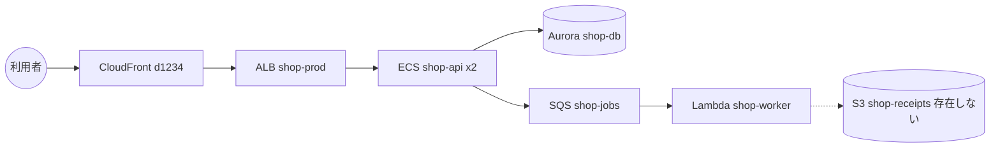

# 報告 — 何を書けば役に立つか

成果物は `out/report/構成報告.md` と `out/report/ユーザー確認事項.md` の 2 つです。
読み手は、このアカウントを初めて見る技術者です。資料も引き継ぎも無く、報告だけを渡されます。
読み終えたときに「このアカウントは何をしていて、どう組まれていて、どこが気になるか」が言えるなら、報告は役に立っています。
リソースの一覧が並んでいるだけなら、役に立っていません。一覧は AWS のコンソールを開けば見えます。

## 守ること

1. **事実と推測を分ける。** 事実は API の応答にあったもの、推測はそこから導いた解釈。推測は書きます。
   「名前から注文 API と思われる」「環境変数の名前から DynamoDB を使うらしい」のように、推測と分かる書き方で、根拠を添えます。
   推測を書かないと、報告が一覧の寄せ集めになります。推測を事実のように書くと、後から読む人が検証できなくなります。
2. **根拠は `raw/` のファイル名。** 事実には `raw-ec2-instances.json` のように出典を添えます。複数の生データを突き合わせて言えることは、
   出典を書かずに言い切って構いません。裏を取りたい人は `raw/` を引きます。
3. **読めなかった・見ていないは、そう書く。** 権限で拒否されたもの、見ていないリージョンを黙って埋めません。
4. **「不要」「消してよい」と断定しない。** 気づいたことは根拠つきで「気になる点」に書き、判断は読み手に残します。
   並行する世代が現役のことがあり、使われていないように見えるものが動いていることがあります。
5. **現在形で書き、履歴を残さない。** 「第 N 回で訂正」「追加調査で判明」は書かず、いま分かっていることだけを書き、間違いは本文を書き直します。

## `report/構成報告.md` の骨子

この順で、この見出しで書きます。読み手は上から読み、途中で止めても要点が手に入るようにします。

### 1. このアカウントは何か

1 ページ。読み手が最初に読み、ここだけ読んで帰ることもある節です。

- 何を提供しているアカウントか（推測なら推測と書く）。系統（独立したシステム）がいくつあり、それぞれの入口と主な構成要素
- 動いている根拠（メトリクス・課金・最終更新）。動いていないように見えるものがあれば、それも
- 環境の分け方（prod / stg / dev、世代）が見て取れるか
- 一番気になる点を 3 つまで（詳しくは「気になる点」の節へ）
- 見ていないもの（リージョン・権限で読めなかったサービス）

### 2. 構成図

Mermaid で、入口 → コンピュート → データストアの流れを描きます。系統が複数あれば系統ごとに 1 つ。
図に入れるのは繋がりが分かっているものだけで、推測の線は点線（`-.->`）にします。図に入らなかったものは 4 節に書きます。



### 3. 系統ごとの構成

系統 1 つにつき小見出し 1 つ。ネットワーク・権限・監視・稼働状況はカテゴリとして別に立てず、**その系統の話としてここに書きます。**
散らすと、繋げれば言えることが言えなくなります。

- **経路**: 入口（ドメイン・CloudFront・ALB・API Gateway・関数 URL・イベント）から、コンピュート（何が、どのランタイム・イメージで）、
  データストア（何を読み書きするか）まで、辿れたところまで文章で
- **構成要素の表**: 1 リソース 1 行。名前・種類・役割（推測なら「らしい」）・稼働の根拠・出典。「Lambda が 2 個」ではなく、2 個それぞれを書きます

  | 名前 | 種類 | 役割 | 稼働 | 根拠 |
  | --- | --- | --- | --- | --- |
  | `shop-api` | ECS サービス（Fargate、2 タスク） | 注文 API。ALB から 443 で受ける | 直近 7 日のリクエスト 12 万 | `raw-ecs-services.json` |
  | `shop-worker` | Lambda（Python 3.12） | SQS `shop-jobs` を処理し、領収書を S3 に置くらしい（コード未読） | 直近 30 日の呼び出し 0 | `raw-lambda-functions.json` |

- **繋がりの中で分かること**: 権限（実行ロールが参照先を許しているか）、ネットワーク（SG が何を受けるか、公開か）、監視（アラームと通知先）、
  ログの保持。複数の事実を突き合わせて初めて言えることをここで言います。「設定が名指しする S3 バケットが存在せず、実行ロールにも許可が無く、
  呼び出しも無い」は 1 文にまとめて書きます
- **中を読んだもの**: EC2 の中や Lambda のコードを読めた場合、何が動いていて何を呼ぶかをここに書きます（`method/routes.md`）

### 4. 系統に入らないもの

どの系統にも繋がらなかったリソース、参照先の無い設定、参照されていないもの。1 つずつ、何で、いつから、何に繋がっていそうかを書きます。
「見当たらない」と書く前に、他のリージョン・他の名前・関連する API で確かめます。

### 5. 権限とアクセス

誰が、どこから、何をできるかの節です。ここも 1 行 1 リソースの表にします。サービスリンクロールは 1 行にまとめて構いません。

| ロール | 誰が使えるか（信頼関係） | 何ができるか（主なポリシー） | 使われている形跡 |
| --- | --- | --- | --- |
| `shop-api-task` | ECS タスク | `shop-db` の Secrets 読み取り、`shop-receipts` の書き込み | ECS サービスに付いている |
| `github-deploy` | GitHub Actions（OIDC、`org/shop` の `main`） | ECR の push、ECS のデプロイ | 最終使用 2026-09-10 |
| `AdministratorAccess-*` | IAM Identity Center の管理者 | 管理者 | 最終使用 2026-09-12 |

IAM ユーザーとアクセスキー、外部 ID プロバイダ（OIDC / SAML）、公開されているもの（S3 の公開設定、0.0.0.0/0 の受信規則、関数 URL の認証なし）、
KMS キーと Secrets / パラメータの名前もここに書きます。

### 6. 気になる点

読み手が次に何を確かめるべきかを伝える節です。事実の突き合わせから言えることを、根拠と一緒に書きます。
評価ではなく観察として書きますが、遠慮して薄くしないでください。この節が空の報告は、たいてい見落としがあります。

- 1 項目につき、何が・どこで・根拠・何を確かめれば決まるか
- 種類を頭に付けます: **不整合**（設定と実体が合わない）・**到達できない**（参照先が無い、権限が無い）・**動いていないらしい**・**公開**・**単一障害点**・**期限**（証明書・キー）・**未確認**
- 「不要」「消してよい」「危険」とは書きません。「〜の状態にある。意図したものかはユーザーに確認」まで

### 7. 外からは分からないこと

AWS の API では決められなかったことを、何を見れば決まるかと一緒に書きます。この節が `ユーザー確認事項.md` の元です。

### 8. 付録: 網羅性

何を見て、何が無く、何を読めなかったかを表で。件数を書くのはここだけです。「無かった」にも生データの名前を添えます。

| 領域 | 見たもの | 結果 | 根拠 |
| --- | --- | --- | --- |
| リージョン | Cost Explorer とタグ検索で当たりを付けた 3 リージョン | 東京のみ。他 2 つは既定リソースだけ | `raw-resource-search-*.json` |
| コンピュート | EC2 / ECS / Lambda / App Runner | EC2 1 台、Lambda 2 個。ECS と App Runner は無し | `raw-ec2-instances.json` … |
| データ | RDS / DynamoDB / ElastiCache / S3 / バックアップ | 無し | `raw-rds-*.json` … |
| 配信 | CloudFront / ALB・NLB / API Gateway / ACM / Route 53 | 無し | … |
| 非同期 | SQS / EventBridge / Step Functions | 無し | … |
| 監視 | アラーム / SNS / ロググループ / CloudTrail / Config | 無し | … |
| 権限 | ロール / ユーザー / IdP / KMS / Secrets / パラメータ | 5 節に | … |
| 稼働 | 課金 / メトリクス / 未使用に見えるもの | 1 節・6 節に | … |

## `report/ユーザー確認事項.md`

ユーザーがこれだけを読んで、何に答えればよいかが分かり、**その場で答えを書き込める**ファイルです。2 つの節に分け、答えやすい順に並べます。

**中を見れば分かること。** EC2 の中・Lambda のコード・ECS のイメージのように、中を読めば決まるもの。
`survey-status` に経路が出ているものはここに書かず、読んで報告に書きます。経路が無いものだけ、どのリソースを・なぜ見たいか（報告のどこが埋まるか）と、
用意してもらう依頼文（`method/routes.md`）を添えます。無ければ「なし」と 1 行。

**ユーザーにしか分からないこと。** AWS の外（GitHub Actions・Cloudflare・他の SaaS・DNS の登録先）、利用者・運用の事情・名前の意味・意図。
1 つの問いは、質問 1 文の見出し・背景 2〜3 文・回答欄の 3 つで書きます。問いを吟味した観点（なぜ聞くのか・答えの使い道）を項目として並べません。

```
### Q1. `api-*` の Lambda と EC2 `app1` は、1 つのシステムですか。誰が使うものですか

背景: 主に見るリージョンに `app1` 1 台と `api-orders`・`api-images` があり、どれも同じ用途を示すタグが付いています。
両者を繋ぐ設定は AWS 上に無く、1 つのシステムとして扱うか、別々の環境として扱うかで、報告の系統の分け方が変わります。

回答:
（ここに書いてください）
```

アカウントの中で調べれば決まることは、ここに書きません。「見当たらない」は、他のリージョン・他の名前・関連する API を確かめてから書く言葉です。
回答欄に答えが書かれていたら、`report/前提.md` に移し、報告の本文を書き直し、その問いを消します。

## 完了の基準

報告を「書けた」と言う前に、読み手の立場で確かめます。

- [ ] 1 節だけ読んで、このアカウントが何をしているか（または分からない理由）が言える
- [ ] 構成図があり、3 節の経路と食い違わない
- [ ] 主要なリソース（コンピュート・データストア・入口・ロール）が 1 つずつ表にあり、役割が書いてある。本文に「〜は N 個」だけの文が無い
- [ ] 6 節に、事実の突き合わせから言えることが根拠つきで書いてある（本当に何も無いなら、そう書いてある）
- [ ] 推測が推測と分かる書き方になっている。読めなかったもの・見ていないリージョンが書いてある
- [ ] `ユーザー確認事項.md` が単体で読め、各問いに回答欄があり、「中を見れば分かること」には依頼文がある
- [ ] 生データが `raw/` に残り、同じ問いに API を叩き直さずに答えられる

## 検証 — 書いた回とは別の回で

自分が書いた直後は「これは調べた」と思って読み進めてしまいます。次の回の最初の仕事として、`out/` にあるものだけを見て確かめます。
報告があって台帳に検証の記録が無ければ、それが最初の仕事です（ユーザーが先に何か聞いてきたら、そちらが先）。

| 見ること | やり方 |
| --- | --- |
| 正しいか | 出典の `raw-*.json` が実在するか。出典付きの記述をいくつか選び、`jq` で引いて数と名前を突き合わせる（選んでから開く。全部は見なくてよい） |
| 推測が事実になっていないか | 名前から用途を決めつけている箇所。`raw/` のどこにも無い断定は推測 |
| 役に立つか | 上の「完了の基準」を 1 つずつ。1 節と図だけで全体が掴めるか、表に役割があるか、6 節が薄くないか |
| 黙って埋めていないか | 拒否された操作・読めなかったものが報告か確認事項に残っているか |

食い違いは `out/.survey/log/NN-verify.md` に残し（見た件数・食い違い・直したもの・引き直した問い合わせ・確認事項へ移したもの）、
本文を直します。もう一度 AWS に聞けば決まることは聞いて決め、引き直した生データを `raw/` に保存します。
「全部見た」と書かず、何件見たかを書きます。終わったら台帳の「作業」に、検証を通したことと記録の場所を書きます。
