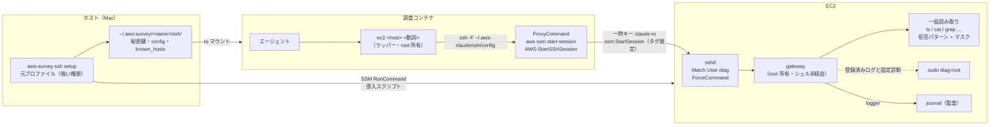

# 設計: EC2 の中を調べる（SSH over SSM + 診断ゲートウェイ）

調査コンテナのエージェントが、対象 EC2 インスタンスの OS 内部（ログ・サービス状態・リソース状況）を
調べられるようにする機能の設計。第 10 節の第 8 段まで実装済み（ホスト側の導入と登録、IAM ポリシーと `role` / `credentials` / `verify`、
調査コンテナの `ec2` ラッパーとフック、`aws-survey ssh verify`、文書と `survey-status`、鍵の作り直し `rotate` と後片付け `remove`、
SSM セッションの起動時の後片付けと `remove` でのポリシーの片付け）。

## 1. 目標と方針

やりたいこと。

- Apache / nginx / アプリケーションのログ、systemd の状態、`ps` / `free` / `df` / `ss` / `sar` / journal による調査
- 削除・変更・再起動・プロセス停止・任意の `sudo` は、そもそも実行できない
- **セットアップは強い権限の人間が 1 コマンド**。鍵の生成・配布・sshd の設定まで含めて自動化する
- ログインユーザー名は任意に選べる
- 調査の実行は調査コンテナから。鍵もコンテナから使える
- EC2 に残すものは目立たない名前にする。後片付けで消すが、それまでの間も「AI 用」と分かる名前を付けない

方針は既存の aws-survey と同じ。**安全性をエージェントの自制に依存させない**。EC2 側で「読めるもの」と
「実行できる診断」を決め、それ以外は存在しない。プロンプトとフックは事故防止の層であり、境界ではない。

読み取りの範囲は「**誰の権限で読むか**」で 2 段に分ける（§5）。

| 段 | 権限 | 範囲 | 守り |
| --- | --- | --- | --- |
| 一般読み取り | ログインユーザー自身 | 任意パスの一覧・閲覧・検索 | OS の権限 + 拒否パターン + マスク + 資源上限 |
| root 読み取り | `sudo diag-root` | 登録済みログと固定の診断だけ | 許可リスト。広げない |

読み取り専用のアカウントを渡された運用担当者ができることを一般読み取り段に置き、root だけを診断 API に閉じ込める。
調査の現実（ログの場所は事前に分からない、`ls` / `stat` / `du` が調査の半分）と、
OS の権限モデルが最初から効いていること（`/etc/shadow`・`/root`・他人の `~/.ssh` は一般ユーザーに読めない）を踏まえた線引き。

既存設計からの意図的な変更が 1 つある。既存は `logs:GetLogEvents` や `s3:GetObject` を Deny して
**ログ本文を見せない**立場だが、この機能はログ本文を読むことが目的である。秘匿らしき値をマスクするが、
マスクは経験則である。`security.md` に明記する（userData と同じ扱い）。

## 2. 名前

EC2 に残すものの名前はすべて `diag` で統一する。「ai」「agent」「survey」を含めない。
汎用の診断用アカウントに見える名前にし、後片付けで `aws-survey ssh remove` が一括で消す。

| もの | 名前 |
| --- | --- |
| ログインユーザー（既定。`--user` で変更可） | `diag` |
| ゲートウェイ | `/usr/local/lib/diag/gateway` |
| root ヘルパー | `/usr/local/lib/diag/diag-root` |
| 設定 | `/etc/diag/diag.conf` |
| sshd 設定 | `/etc/ssh/sshd_config.d/diag.conf` |
| sudoers | `/etc/sudoers.d/diag` |
| journal のタグ | `diag-gateway` |
| ロック | `/run/diag.lock`（再作成の定義は `/etc/tmpfiles.d/diag.conf`） |
| EC2 のタグ | `diag:ssh=<name>` |
| IAM ポリシー | `diag-ssh-<name>`（ロール名は既存の `auth.role_name` のまま） |

`<name>` は `environment.json` の `name`（対象フォルダごとの短い英数字名）。タグと IAM ポリシーは AWS 側に残るもので、
ロール自体が調査用と分かる名前を既に持っているため、ここまで隠さない。

## 3. 全体像



守りは 4 層。上から順に「境界」で、下に行くほど「事故防止」。

| 層 | 何が守るか | エージェントが触れるか |
| --- | --- | --- |
| IAM | `ssm:StartSession` は `diag:ssh=<name>` タグ付きインスタンスと `AWS-StartSSHSession` だけ | 触れない |
| sshd + 鍵 | `Match User` で ForceCommand・pty 禁止・転送禁止。鍵は `restrict,command=` 付き | 触れない |
| ゲートウェイ | 動詞と引数の検証。シェルを経由しない。資源上限。root は固定動詞だけ。journal に記録 | 触れない（root 所有） |
| コンテナのフック | `ssh` / `scp` の直接実行を拒否し、`ec2` ラッパーだけ通す。監査ログ | 触れない（root 所有）だが境界ではない |

二要素になっている点が重要。**一時キーだけでは鍵が無いので入れず、鍵だけでは IAM が無いので届かない。**

## 4. セットアップ（ホスト）

### 4.1 コマンド

```bash
aws-survey ssh setup <instance-id | Name タグ> [--alias <名前>] [--user <name>] [--log <名前>=<パス or glob>]... [--deny <glob>]... [--strict]
aws-survey ssh setup --print [...]          # 導入スクリプトを標準出力に出すだけ（手動実行用）
aws-survey ssh list                         # 登録済みホストと導入状態
aws-survey ssh verify <host>                # コンテナから自己診断を打つ（§7）
aws-survey ssh rotate                       # 鍵を作り直し、登録済みホスト全部に再導入（§4.6）
aws-survey ssh remove <host>                # ユーザー・sshd 設定・sudoers・ゲートウェイ・設定を撤去し、タグを外す（§4.6）
aws-survey ssh remove --print <host>        # 撤去スクリプトを標準出力に出すだけ（手動実行用）
```

- `--log` は root 読み取り段に登録するログ。一般ユーザーで読めるログには不要（§5.3）。
- `--deny` は一般読み取り段の拒否パターンに足す glob。ホスト固有の秘密の置き場を隠すため。
- `--strict` は一般読み取り段を無効にし、登録済みログと固定診断だけにする。感度の高いホスト向け。
- `--alias` は `config` の `Host` 名（コンテナから `ec2 <host>` で呼ぶ名前）。省略時は Name タグ、
  それが名前に使えなければ instance-id。同じ別名を別のインスタンスに付け直すことはできない（`--alias` で分ける）。

`setup` は冪等。2 回目は鍵・ゲートウェイ・設定を上書きするだけで、ユーザーは作り直さない。
引数なしの `aws-survey` は、`environment.json` に `ssh.hosts` があれば `status` に表示するだけで、
セットアップを段階に組み込まない（EC2 調査は任意の追加機能）。

### 4.2 setup が行うこと

元プロファイル `auth.source_profile`（MFA 済み・強い権限）で実行する。調査コンテナには持ち込まない。

1. **前提確認**: `ssm describe-instance-information` で対象が SSM 管理下（`PingStatus=Online`）か見る。
   そうでなければ、インスタンスプロファイルに `AmazonSSMManagedInstanceCore` が要ることを案内して終わる。
   ここだけは自動化しない（他人のインスタンスの IAM を勝手に変えない）。
2. **鍵の生成**: `$AWS_DIR/ssh/id_ed25519` が無ければ `ssh-keygen -t ed25519 -N '' -C diag` で作る。
   対象フォルダ（`name`）ごとに 1 対。既存の一時キーと同じ場所なので、コンテナへは同じ ro マウントで渡る。
   鍵のコメントにも `<name>` を入れない（authorized_keys に残るため）。
3. **導入スクリプトの生成**: `libexec/ec2/install.sh.tmpl` に、ユーザー名・公開鍵・ゲートウェイ本体・
   `diag-root`・ログ登録・拒否パターン・strict フラグを埋め込んだ 1 本の bash を作る（§5）。
4. **SSM RunCommand で実行**: `ssm send-command --document-name AWS-RunShellScript` で root 実行し、
   `get-command-invocation` で完了を待つ。標準出力の末尾にある `HOSTKEY <type> <base64>` 行を回収する。
   - `--print` のときはここを飛ばし、スクリプトを出力して終わる。SSM 管理下でない・別経路の管理がある場合の逃げ道。
5. **タグ付け**: `ec2 create-tags` で `diag:ssh=<name>` を付ける。IAM 側の条件はこのタグを見る。
6. **クライアント設定の生成**: `$AWS_DIR/ssh/config` と `known_hosts` を書く。

   ```
   Host web1
       HostName i-0123456789abcdef0
       User diag
       IdentityFile ~/.aws-claude/ssh/id_ed25519
       IdentitiesOnly yes
       ProxyCommand aws ssm start-session --target %h --document-name AWS-StartSSHSession --parameters portNumber=%p
       StrictHostKeyChecking yes
       UserKnownHostsFile ~/.aws-claude/ssh/known_hosts
       BatchMode yes
       RequestTTY no
       ForwardAgent no
       ServerAliveInterval 15
   ```

   `known_hosts` の行は `i-0123... <type> <base64>`。SSM 経由でも中間者を排除できる（手順 4 で root から直接回収した鍵）。
7. **記録**: `environment.json` の `ssh.hosts.<alias>` に instance_id・user・logs・deny・strict・installed_at を書く。

### 4.3 導入スクリプトの大きさ

`AWS-RunShellScript` の `commands` に渡す。組み立てた 1 本は約 65 KB（ゲートウェイと `diag-root` を素の heredoc で含む）。
公開されている上限は「ドキュメント 64 KB」だが、`SendCommand` が実際に見るのは**パラメータとドキュメントの合計で 97 KB**
（超えると `MaxDocumentSizeExceeded`。エラー文にこの数字が出る）。第 3 段の実測（2026-09-10、Amazon Linux 2023）:

| 送った形 | 大きさ | 結果 |
| --- | --- | --- |
| 素の bash（既定） | 64,859 バイト | 通る。導入まで成功 |
| コメントで水増しした無害なスクリプト | 81,940 バイト | 通る |
| 同上 | 102,401 バイト | `MaxDocumentSizeExceeded`（97KB limit） |
| gzip + base64 を 1 つの heredoc で渡し、EC2 側で展開して実行 | 26,488 バイト | 通る。導入まで成功（冪等な 2 回目として実行） |

既定は素のまま送り、`SendCommand` が大きさで拒否したときだけ gzip + base64 に畳んで送り直す（`setup` の出力に「送った形」が出る）。
`AWS_SURVEY_SSH_PACK=1` で最初から畳んだ形にできる（畳んだ経路を確かめる開発用）。素のままで 30 KB ほど余裕があるが、
ゲートウェイを大きくするときはこの表を目安にする。S3 経由は使わない（調査側で `s3:GetObject` を Deny している設計と噛み合わないし、
余計なバケットを作りたくない）。

### 4.4 environment.json

```json
"ssh": {
  "user": "diag",
  "hosts": {
    "web1": {
      "instance_id": "i-0123456789abcdef0",
      "user": "diag",
      "installed_at": "2026-09-09T10:00:00+09:00",
      "logs": { "app": "/var/www/app/log/*.log" },
      "deny": ["/var/www/app/config/*"],
      "strict": false
    }
  }
}
```

- `ssh.user` の既定は `diag`。`--user` で変える。検証は `^[a-z_][a-z0-9_-]{0,31}$`。
  `init` の 9 項目には足さない（EC2 調査は任意機能なので `setup` 時に決める）。ホストごとの `user` は導入時の値で、
  `config` の `User` はこちらを使う。
- `load-env.sh` は `SSH_USER` と `SSH_HOSTS`（alias の一覧）を読むだけ。
- 記録は導入が成功し、タグが付いてから書く。途中で失敗したら environment.json・`config`・`known_hosts` には触れない。
  `config` は `ssh.hosts` 全体から毎回作り直し、`known_hosts` はそのインスタンスの行だけ入れ替える。
- 鍵の作成日時は記録しない。鍵ファイルの更新日時がそのまま作成日時で（`rotate` は新しいファイルを移動するので日時が残る）、
  `ssh list` はそれを表示する。

### 4.5 導入スクリプトが EC2 に作るもの

| 置き場 | 内容 | 所有 / 権限 |
| --- | --- | --- |
| `/usr/local/lib/diag/gateway` | ForceCommand の実体（Python 3、標準ライブラリのみ） | root / 755 |
| `/usr/local/lib/diag/diag-root` | root が要る少数の診断（Python 3） | root / 755 |
| `/etc/diag/diag.conf` | 登録済みログ、拒否パターン、strict | root / 644 |
| `/etc/ssh/sshd_config.d/diag.conf` | `Match User` ブロック（Include が無い古い sshd は `sshd_config` 末尾にマーカー付きで追記） | root / 600 |
| `/etc/sudoers.d/diag` | `diag-root` 1 本だけの NOPASSWD | root / 440 |
| `/etc/tmpfiles.d/diag.conf` | 再起動後に `/run/diag.lock` を作り直す 1 行（`/run` は tmpfs で、ログインユーザーは `/run` 直下に作れない） | root / 644 |
| `/run/diag.lock` | ゲートウェイの直列化ロック | root:<user のグループ> / 660 |
| `/home/<user>/.ssh/authorized_keys` | `restrict,command="/usr/local/lib/diag/gateway" ssh-ed25519 ...` | user / 600、ディレクトリ 700 |

導入スクリプトの手順。

1. ユーザー作成: `useradd --system --create-home --shell /bin/bash <user>`。
   対話ログインは sshd 側の `PermitTTY no` と ForceCommand で塞ぐ。シェルを `nologin` にすると ForceCommand も
   動かなくなるはずなので `/bin/bash` にする（実装時に確認）。パスワードはロックのまま。
2. 読み取りのためのグループ: `adm`、`systemd-journal` があれば追加。これで Debian 系の `/var/log` と journal は
   一般読み取り段で読める。Amazon Linux の `/var/log/messages` / `secure` は root 専用なので、自動検出して root 読み取り段に登録する。
3. ファイル配置と権限（上の表）。
4. sshd 設定。

   ```
   Match User diag
       ForceCommand /usr/local/lib/diag/gateway
       PermitTTY no
       DisableForwarding yes
       PermitTunnel no
       PermitUserRC no
       AuthenticationMethods publickey
       PasswordAuthentication no
       ClientAliveInterval 15
       ClientAliveCountMax 3
   ```

   `ClientAliveInterval` / `ClientAliveCountMax` は、クライアント側の `ssh` が消えて応答が無くなった接続を sshd が閉じるため
   （§7「セッションの終わり方」）。`sshd -t` で検証してから `systemctl reload sshd`。**restart ではなく reload**（既存セッションを落とさない）。
   検証に失敗したら書いた設定を戻して非ゼロで終わり、setup がそれを表示する。sftp サブシステム要求も
   ForceCommand に置き換わるため、scp / sftp は同時に塞がる。
   Ubuntu 24.04 のように sshd がソケット起動で常駐していないときは reload する対象が無く、次の接続から新しい設定が効く。
5. sudoers: `<user> ALL=(root) NOPASSWD: /usr/local/lib/diag/diag-root` と `Defaults:<user> !requiretty`。
   `visudo -c` で検証してから置く。
6. `diag.conf` の生成（§5.3 の自動検出 + `--log` + `--deny` + strict）。
7. 動作確認: `sudo -u <user> /usr/local/lib/diag/gateway` を `SSH_ORIGINAL_COMMAND=uptime` で叩いて成功、
   `SSH_ORIGINAL_COMMAND='bash'` で拒否されることを確かめる。
8. 最後に `HOSTKEY` 行を出す: `for f in /etc/ssh/ssh_host_*_key.pub; do echo "HOSTKEY $(cut -d' ' -f1,2 $f)"; done`。

対応 OS は Amazon Linux 2 / 2023、Ubuntu 20.04 以降、Debian 11 以降。パッケージの導入はしない
（`sar` が無ければ `sar` 動詞は「未導入」と返す。本番機に勝手に入れない）。

### 4.6 rotate と remove

どちらも `setup` と同じく元プロファイルで実行し、途中で失敗したら記録に触れない。

**`ssh rotate`**（鍵の作り直し）。

1. 新しい鍵を `$AWS_DIR/ssh/id_ed25519.next` に作る。いまの鍵はそのまま。
2. `ssh.hosts` の全ホストへ別名順に、各ホストの記録（`user` / `logs` / `deny` / `strict`）と新しい公開鍵で導入スクリプトを組み立てて
   送る（§4.2 の手順 4 と同じ。冪等な再導入）。SSM 管理下でない・RunCommand が失敗した・`HOSTKEY` 行が無い、のどれかで**そこで止める**。
3. 全ホストに入ったら `.next` を `id_ed25519` に移し、`known_hosts` を入れ替え、各ホストの `installed_at` を更新する。
   `config` は変わらない（鍵のパスは同じ）。起動中の調査コンテナは読み取り専用マウント越しに同じ場所を見ているので、次の接続から新しい鍵になる。
4. 途中で止まったら `.next` を捨て、いまの鍵・記録・`config`・`known_hosts` は変えない。失敗までに新しい鍵になったホストは
   いまの鍵では届かなくなるので、その別名を表示し、`ssh rotate` のやり直し（全ホストに入れ直す）か `ssh setup <host>`
   （そのホストだけいまの鍵に戻す）を案内する。鍵を 2 本持たない（`.next` を残しても、コンテナに渡るのは `id_ed25519` だけ）。

**`ssh remove <host>`**（後片付け）。`setup` の逆順で、EC2 側が済んでからタグと記録を消す。

1. 別名から `instance_id` と `user` を引く。インスタンスが無い（terminated か `InvalidInstanceID.NotFound`）ときは EC2 側とタグを飛ばして記録だけ消す。
   running でない・SSM 管理下でないときは止め、`remove --print <host>` で撤去スクリプトを書き出して手実行する道を案内する。
2. 撤去スクリプト（`libexec/ec2/remove.sh.tmpl`。埋めるのはユーザー名だけ）を `AWS-RunShellScript` で root 実行する。
   sshd の drop-in とマーカー付きブロックを消して `sshd -t`（失敗なら戻す）→ reload、`/etc/sudoers.d/diag` を消して `visudo -c`、
   `/usr/local/lib/diag`・`/etc/diag`・`/etc/tmpfiles.d/diag.conf`・`/run/diag.lock` を消し、ユーザーのプロセスを止めてから
   `userdel -r`（`authorized_keys` はホームごと消える）。最後に §4.5 の表の全部と `id <user>` を見て、残っていなければ
   `REMOVED clean`、残っていれば `REMOVED leftover <パス>...` を出して非ゼロ。スクリプトは冪等で、やり直すと残ったものだけ消す。
3. `REMOVED clean` を確かめてから `ec2 delete-tags`（`Key=diag:ssh,Value=<name>`）。
4. `environment.json` の `ssh.hosts.<alias>` を消し、`known_hosts` からそのインスタンスの行を消し（同じインスタンスを別の別名でも
   登録していれば残す）、`config` を作り直す。鍵は残す（次の `setup` がそのまま使う）。
5. 最後のホストを消したときは、`diag-ssh-<name>` ポリシーも片付ける（5/5）。自分で作ったロール（`own_role`）のときだけ、
   元プロファイルで `detach-role-policy`（ロール `auth.role_name`）→ `list-policy-versions` で既定でない版を `delete-policy-version` →
   `delete-policy` の順に行う（既定でない版が残っていると `delete-policy` は `DeleteConflict` になる）。`get-policy` が `NoSuchEntity` なら
   何もしない。借りたロールの経路（`existing_role` / `granted_role`）ではポリシーに触らず、管理者に打ってもらう同じ 4 コマンドを表示する。
   ここで失敗しても EC2 側・タグ・記録は済んでいるので、残ったものと手で打つコマンドを表示して非ゼロで終わる。
   `role --create` は変えない（登録が無いときはポリシーを付けず、付いているものを外しもしない）。
   `credentials` の再発行を案内する。**発行時に `--policy-arns` で渡したポリシーを消すと、その一時キーは読み取りも含めて全部拒否される**
   （2026-09-10 の実測。`remove` の直後に古いキーで `verify` を打つと `get-caller-identity` から落ちる）ので、案内は「使えなくなった」と書く。
   `setup` → `role --create` でポリシーを作り直した直後の `credentials` は `AssumeRole` が失敗することがあり（同日の実測。
   作成から 20 秒ほど置いてやり直すと通った）、IAM の反映待ちとして扱う。

EC2 側が失敗したらタグも記録も触らない。タグ外しが失敗したときは EC2 側は済んでいるので、同じコマンドのやり直しで続きから進む。

## 5. ゲートウェイの仕様

### 5.1 原則

- 入力は `SSH_ORIGINAL_COMMAND` の 1 本だけ。`shlex.split` で分解し、**検証済みの argv を `subprocess.run` に list で渡す**。
  `shell=True` も `bash -c` も使わない。`;` `|` `$()` は、そもそも解釈する層が無い。
- 未知の動詞・未知のオプション・書式に合わない値は、理由を 1 行返して終了コード 2。
- すべて `timeout 30`（`journal` / `grep` / `find` / `du` は 60）、`nice -n 19` + `ionice -c 3`、
  出力は 1 MiB で打ち切って末尾に `[truncated]` を付ける。同時実行は `/run/diag.lock` の `flock` で 1 本。
- 実行前に `logger -t diag-gateway "<user> <verb> <args> allow|deny:<reason>"` で journal に記録する。
  この記録はエージェントが触れない場所にある。
- 一般読み取り段のファイル内容には、拒否パターン（§5.4）とマスク（§5.5）を掛ける。
- root 読み取り段（`diag-root`）は固定動詞と登録済みログだけ。任意パスは今後も足さない。

### 5.2 動詞と引数

#### 一般読み取り段（ログインユーザーの権限で実行。`--strict` では無効）

パスは絶対パスのみ。`os.path.realpath` で正規化してから拒否パターンと照合する（シンボリックリンク経由の迂回を防ぐ）。

| 動詞 | 実行するもの | 引数 |
| --- | --- | --- |
| `ls <path>` | `ls -la --time-style=long-iso` | `--recursive`（深さ ≤3、件数 ≤2000） |
| `find <dir>` | `find <dir> -maxdepth N -name <pat> [-newermt <date>] [-size +N]` | `--name <glob ≤80 字>`、`--depth N`（≤5、既定 3）、`--newer <日時>`、`--larger <size>`。`-exec` 等は無い |
| `stat <path>` | `stat` | なし |
| `du <dir>` | `du -sh` と `du -d 1 -h \| sort -h` の上位 | `--depth 1\|2` |
| `cat <path>` | 全体（≤1 MiB。超える場合は先頭と末尾を出して案内） | なし |
| `head <path>` / `tail <path>` | `head -n N` / `tail -n N`。`.gz` は `zcat` | `--lines N`（≤5000、既定 200） |
| `grep <path>...` | `grep -E -n --` を 1 ファイルずつ、`-r` は `--recursive` のときだけ深さ制限付き | `--pattern <ERE ≤200 字>`、`--context N`（≤5）、`--ignore-case`、`--recursive`、`--max N`（≤2000、既定 500） |

#### 固定診断（ログインユーザーの権限。strict でも使える）

| 動詞 | 実行するもの | 引数 |
| --- | --- | --- |
| `uptime` | `uptime` | なし |
| `os` | `/etc/os-release`、`uname -a`、`hostnamectl` | なし |
| `ps` | `ps -eo pid,ppid,user,%cpu,%mem,rss,etime,stat,args --sort=-%cpu` | `--top N`（≤500、既定 100）、`--sort cpu\|mem` |
| `proc <pid>` | `/proc/<pid>/status`、`limits`、`fd` の数、`cmdline` | pid は数字のみ。**`environ` は出さない** |
| `free` | `free -m` | なし |
| `vmstat` | `vmstat 1 N` | `--count N`（≤10、既定 5） |
| `df` | `df -hT` と `df -ih` | なし |
| `sar <種別>` | `sar -u` / `-r` / `-b` / `-n DEV` / `-q`、`-f` で当日と前日 | `cpu\|mem\|io\|net\|load`、`--day today\|yesterday` |
| `net` | `ip -br addr`、`ip route`、`ss -tuln`（`-p` 無し） | なし |
| `services` | `systemctl list-units --type=service --all --no-pager` | なし |
| `failed` | `systemctl --failed --no-pager` | なし |
| `service <unit>` | `systemctl status <unit> --no-pager -l -n 50` | unit は `^[A-Za-z0-9@._-]{1,80}$` |
| `unit <unit>` | `systemctl cat <unit>` | 同上 |
| `timers` | `systemctl list-timers --all --no-pager` | なし |
| `journal [unit]` | `journalctl -u <unit> --since <dur> -n N --no-pager -o short-iso` | `--since 30m\|2h\|1d`（≤7d）、`--lines N`（≤5000、既定 500）、`--grep <pat>`、`--priority err`。グループで読めなければ root 段へ |
| `logs` | `diag.conf` の登録済みログと実ファイル（ローテート済み含む）とサイズ | なし |
| `help` | 動詞一覧とこの表の要約 | なし |

#### root 読み取り段（`sudo diag-root`。動詞はこの 5 つで固定）

| 動詞 | 実行するもの | 引数 |
| --- | --- | --- |
| `listeners` | `ss -tulpn`（他ユーザーのプロセス名を出すため root） | なし |
| `dmesg` | `dmesg -T` の末尾 | `--lines N`（≤2000） |
| `cron` | `/etc/crontab`、`/etc/cron.d/*`、各ユーザーの `crontab -l` | なし |
| `journal [unit]` | 上と同じ。グループで読めないときだけ | 上と同じ |
| `log <名前>` | 登録済みログの `tail -n N` → `grep -E`。`.gz` は `zcat` | `--tail N`（≤5000）、`--grep`、`--file <logs が出した実名>`、`--context N` |

将来 Docker ホスト向けに `containers`（`docker ps`）と `clog <name>`（`docker logs --tail N`）をここに足す。
docker グループは root 相当なので、一般読み取り段には置かない。

意図的に無いもの: `tail -f`、`top`、`strace`、`tcpdump`、`curl`、`env`、`proc <pid> environ`、任意パスの root 読み取り。

### 5.3 登録済みログ（diag.conf）

root 読み取り段の `log` 動詞が読める範囲。一般ユーザーで読めるログは登録しなくても `tail` / `grep` で読める。
導入スクリプトが root 専用のものを自動検出する。

| 論理名 | 実パス |
| --- | --- |
| `messages` / `secure` | `/var/log/messages*` / `/var/log/secure*`（Amazon Linux） |
| `syslog` / `auth` | `/var/log/syslog*` / `/var/log/auth.log*`（`adm` で読めなければ） |
| `nginx-*` / `httpd-*` | `/var/log/nginx/*`、`/var/log/httpd/*`（root 専用のときだけ） |

`setup --log app=/var/www/app/log/*.log` で足す。glob は**ディレクトリまで**が確定していることを要求し、
`..` と `*` をディレクトリ部分に含めない。`diag-root` は実行時にこの glob を展開し、
展開結果の外にあるパスは決して開かない（`--file` の値は展開結果と照合する）。

### 5.4 拒否パターン（一般読み取り段）

名前とパスで判定する。`ls` の一覧には名前が出るが、`cat` / `head` / `tail` / `grep` / `find --name` の対象にはならない。

- ファイル名: `.env`、`.env.*`、`*.pem`、`*.key`、`*.p12`、`*.pfx`、`id_rsa*`、`id_ed25519*`、`id_ecdsa*`、`*secret*`、`*credential*`、
  `*password*`、`*.keystore`、`*.jks`、`wp-config.php`、`database.yml`、`secrets.yml`、`master.key`、`.htpasswd`、`.netrc`、`.pgpass`、`.my.cnf`
- ディレクトリ: `/root`、`/home/*/.ssh`、`/home/*/.aws`、`/home/*/.gnupg`、`/etc/ssh`、`/etc/diag`、`/etc/sudoers*`、`/etc/shadow*`、
  `/etc/letsencrypt/live`、`/etc/letsencrypt/archive`、`/var/lib/docker`、`.git/`、`/proc/*/environ`、`/proc/*/mem`、`/dev`、`/sys/firmware`
- 拡張子: `*.sqlite`、`*.sqlite3`、`*.db`（データ本体。既存の DynamoDB / RDS の Deny と同じ立場）
- `setup --deny <glob>` の追加分

網羅はできない。**OS の権限で読めない場所はここに載っていなくても読めない**ので、このリストが担うのは
「一般ユーザーが読めるように置かれてしまった秘密」だけ。それは `security.md` に「保証しないこと」として書く。

### 5.5 マスク

一般読み取り段のファイル内容と、root 段の `log` / `cron` の出力に、以下を `***` で置き換える。

- `(password|passwd|secret|token|api[_-]?key|private[_-]?key)\s*[:=]\s*\S+`（大文字小文字を無視）
- `Authorization:\s+\S+\s+\S+`
- `AKIA[0-9A-Z]{16}`、`aws_secret_access_key\s*=\s*\S+`
- `-----BEGIN [A-Z ]*PRIVATE KEY-----` から `END` まで
- URL のユーザー情報 `://[^/@\s]+:[^/@\s]+@`

これで漏れないとは言わない。`security.md` に「経験則」と書く。

### 5.6 diag-root

`sudo` で呼ばれる側。動詞は §5.2 の 5 つに固定し、それ以外は終了コード 2。
引数はゲートウェイと**同じ検証コードを持ち、もう一度検証する**（ゲートウェイを信用しない）。
環境変数は `env_reset` の既定に任せ、`PATH` は固定する。

`journal` は、グループで読めるならゲートウェイ自身が読み、`PermissionError` のときだけ `diag-root` に回す。
root で動く回数を最小にするため。

## 6. IAM と一時キー

`ssm:StartSession` は `ReadOnlyAccess` に無い。**Deny のみ**だった `session-guard.json` の設計は変えず、
`--policy-arns` に顧客管理ポリシーを 1 つ足す。

- `aws-survey role --create` が `diag-ssh-<name>` ポリシーを作り、調査用ロールにアタッチする。冪等で、既にあれば内容を比べ、
  違えば新しい版を既定にする（版は 5 つまでなので、既定でない版を先に消す）。`ssh.hosts` が空のときは作らない
  （EC2 調査は任意機能。`ssh setup` の後にもう一度 `role --create` を打つ）。ロールを借りる経路（`existing_role` / `granted_role`）では
  作れないので、管理者に渡す JSON とコマンドを表示して終わる。
- `aws-survey credentials` が `--policy-arns` に `ReadOnlyAccess` と並べて渡す。`ssh.hosts` が空のときは渡さない（ポリシーが無くても発行できる）。
  ロール側とセッション側の両方に Allow が要る（有効な権限は両者の積）。

```json
{
  "Version": "2012-10-17",
  "Statement": [
    {
      "Effect": "Allow",
      "Action": "ssm:StartSession",
      "Resource": "arn:aws:ec2:*:<account>:instance/*",
      "Condition": { "StringEquals": { "ssm:resourceTag/diag:ssh": "<name>" } }
    },
    {
      "Effect": "Allow",
      "Action": "ssm:StartSession",
      "Resource": "arn:aws:ssm:*:*:document/AWS-StartSSHSession"
    },
    {
      "Effect": "Allow",
      "Action": ["ssm:TerminateSession", "ssm:ResumeSession"],
      "Resource": "arn:aws:ssm:*:*:session/claude-survey-*"
    }
  ]
}
```

`AWS-StartSSHSession` は 22 番ポートを生で通すだけで、認証は sshd が行う。IAM だけではシェルは取れない。
`ssm:SendCommand` は与えない（導入はホストの元プロファイルの仕事）。

セッションの終了・再開は自分のセッションに限る。SSM のセッション ID は `<ロールセッション名>-<乱数>` で、
`credentials` が付けるロールセッション名 `claude-survey-<日時>` が接頭辞になる。AWS の例にある `${aws:userid}-*` は
借りたロールでは `AROA…:claude-survey-<日時>` に展開されて一致しない（2026-09-10 の実測。`TerminateSession` が
`AccessDeniedException` になり、接頭辞に変えて通った）。接頭辞は `load-env.sh` の 1 か所で持ち、`role` と `credentials` が共有する。

`PackedPolicySize`（一時キー発行時の使用率）の実測（2026-09-10）:

| `--policy-arns` | セッションポリシー | 使用率 |
| --- | --- | --- |
| `ReadOnlyAccess` | `session-guard.json`（Deny のみ） | 31% |
| `ReadOnlyAccess` + `diag-ssh-<name>` | 同上 | 32〜33% |

顧客管理ポリシーは ARN で渡すだけなので、ほとんど増えない。`session-guard.json` は触っていない。

## 7. 検証

`aws-survey verify` に 2 項目を足す。

- タグ無しのインスタンスに `start-session` が拒否される（`AccessDeniedException`）
- `AWS-StartInteractiveCommand` / `AWS-StartPortForwardingSession` が拒否される

`verify` の 6・7 項目目。`ssh.hosts` が空なら飛ばす。タグ無しのインスタンスは `describe-instances` で探し（`diag:ssh` が `<name>` でないもの）、
無ければ飛ばす。`start-session` は API が通ると `session-manager-plugin` を起動して対話に入るので、プラグインの無い PATH で叩き、
API の結果だけを見る（万一許可されていても CLI がセッションを作った直後に終了する）。2026-09-10 の実測では 3 つとも
「no identity-based policy allows the ssm:StartSession action」で拒否され、対照実験（登録済みインスタンス + `AWS-StartSSHSession`）は
API が通ってプラグインの探索まで進んだ。

`aws-survey ssh verify <host>` は SSH 側の検証で、`docker run ... ec2 --selftest <host>` としてコンテナから打つ
（ホストの Mac に session-manager-plugin を入れなくて済む）。イメージは `run` と同じ Dockerfile から作り、渡すのは
一時キーと鍵の読み取り専用マウントとリージョンだけ（`out/` も指示書も渡さない）。自己診断が確認するもの。

- `ec2 <host> uptime` が通る
- `ec2 <host> ls /home/<user>/.ssh` は一覧が出るが、`authorized_keys` を `cat` すると拒否パターンで落ちる
- root 読み取り段が動く: 登録済みログがあれば `log <名前> --tail 3`、無いホストでは `dmesg --lines 3`
  （Amazon Linux 2023 の素の状態には `/var/log/messages` が無く、自動登録されるログが無い）
- `cat /etc/hosts` が読める。`--strict` のホストでは strict の理由で拒否される
- ゲートウェイの拒否: `cat /etc/ssh/sshd_config`（拒否パターン）、`proc 1 environ`、未知の動詞 `bash`、
  `'uptime; id'`（`uptime;` という未知の動詞になる）、`cat /etc/shadow`。加えて `stat /etc/shadow` で OS の権限
  （`0000`）を見る
- 直接の `ssh` でもゲートウェイしか動かない: `ssh <host> bash`、`ssh <host> 'uptime; id'` が `denied:` で終わる。
  `ssh -tt` は pty を割り当てられない（PermitTTY no）。`ssh -R` と `ssh -W`（`-L` と同じ direct-tcpip）は拒否される
  （DisableForwarding yes）。`sftp <host>` は使えない（サブシステム要求も ForceCommand に置き換わる）
- 起動時の後片付けが動く: `ssh <host> 'vmstat --count 10'` を接続中に SIGKILL してセッションを残し（ラッパーの異常終了時の
  後片付けが動かない状況）、続く `ec2 <host> uptime` が起動時にそれを見つけて終了したこと（`ec2:` の報せの件数）を見る。
  セッションが残らなかったときは省略にする
- 終わったあとに SSM のセッションが残っていない（下の「セッションの終わり方」）

`ssh <host> 'cat /etc/passwd'` のような「直接の `ssh` に読める内容を頼む」形は、EC2 側では `ec2` 経由と同じ扱いになる
（`/etc/passwd` は一般読み取り段で読める）。これを止めるのはコンテナのフック（§8.2）で、`tests/test_guards.py` が見る。

**セッションの終わり方**（2026-09-10 の実測）。SSM のセッションは、ゲートウェイが終わって EC2 側の sshd が接続を閉じることで
終わる（正常経路は 1 秒ほどで `Terminated`）。session-manager-plugin は stdio モード（`AWS-StartSSHSession`）では自分から
`TerminateSession` を呼ばず、標準入力が閉じても SIGHUP を受けても呼ばない。そのため `ssh` が接続の段階で異常終了したとき
（終了コード 255。転送の拒否・pty の拒否・鍵の不一致・切断など）は、セッションが `Connected` のまま残る。放置しても 10 分ほどで
サービス側が終了させるが、`ec2` ラッパーは 255 で終わったときに、自分（同じ一時キー = `Owner`）がその対象に開始時刻の
60 秒前以降に開いた `Active` なセッションを `describe-sessions` で探して `terminate-session` する（`Terminating` 中のものは数えない）。
`ssm:DescribeSessions` は `ReadOnlyAccess` に、`TerminateSession` は `diag-ssh-<name>` の自分の接頭辞にあり、一時キーで通る。
`ssh verify` は自己診断のあと、元プロファイルが使えれば SSM 側にもセッションが残っていないことを見る。

EC2 側の sshd からも切る（第 7 段で導入、2026-09-10 の実測）。`Match User` ブロックに `ClientAliveInterval 15` と `ClientAliveCountMax 3` を置いた。
クライアント側の `ssh` を接続中に SIGKILL したとき、sshd は最後の応答から 45 秒ほどで `Timeout, client not responding` を出して接続を閉じ
（接続開始から 69 秒。`vmstat --count 10` の出力を送り終えてから 15 秒 × 3 回）、sshd-session とゲートウェイのプロセスは EC2 から消える。
**ただし SSM のセッションはそれでは終わらない。** EC2 側の ssm-session-worker は、消えたクライアントに送った出力の確認応答を待ったまま
sshd からの EOF を読まず（正常経路で終了の起点になる `handleSSHDPortError` がこのセッションでは記録されない）、セッションは
`Connected` のまま残る。終わるのはサービス側のアイドルタイムアウトで、セッション設定（`SSM-SessionManagerRunShell`）を持たない
アカウントでは既定の 20 分（実測: 開始から 20 分 46 秒で `Terminated`。以前の「10 分ほど」は誤り）。

つまり `ClientAliveInterval` が担うのは EC2 側の後片付け（sshd-session・ゲートウェイ・`/run/diag.lock` の解放）で、
SSM 側の後片付けは `ec2` ラッパーの `terminate-session` だけが持つ。
コンテナ側の `config` にある `ServerAliveInterval 15` は逆方向（クライアントがサーバの無応答を検知する）で、この問題には効かない。

**起動時の後片付け**（第 8 段で導入、2026-09-10 の実測）。ラッパーの後片付けは二層にした。

| 層 | いつ | 何を終了するか |
| --- | --- | --- |
| 異常終了時 | `ssh` が 255 で終わったとき | 自分（同じ `Owner`）がその対象に、接続の開始時刻の 60 秒前以降に開いた `Active` なセッション |
| 起動時 | 毎回の接続の前 | 自分（同じ `Owner`）がその対象に残している `Active` なセッション全部。`Terminating` 中のものは除く |

異常終了時の層は、`ssh` がラッパーごと消えたとき（エージェントのコマンドがタイムアウトで殺された、コンテナが落ちた）には動かない。
その分を次の接続が拾うのが起動時の層で、これで「ラッパーが動かなかった場合はサービス側の期限まで残る」が
「次に `ec2` を打つまで残る」に縮む。同じ `Owner` に限るので、別の一時キー（発行し直す前のもの）が残したセッションは見えず、
それはサービス側の期限に任せる。同じホストへ同時に 2 本の `ec2` を送ると、後から始まった方が先の接続を前回の残りと見なして
終了するが、EC2 側で `/run/diag.lock` により 1 本ずつしか処理されないので、同時に送る意味がそもそも無い（`method/06` に「同時に送れるのは 1 本」とある）。

実測（arm64 の Mac の調査コンテナから実 EC2 の AL2023 へ。`vmstat --count 10` を送って 5 秒後に殺した）。

| 殺し方 | クライアント側のプロセス | SSM セッション | 次の `ec2 <host> uptime` |
| --- | --- | --- | --- |
| `ssh` だけを SIGKILL | `aws` と session-manager-plugin も消える（ProxyCommand は `ssh` と一緒に終わる） | `Connected` のまま残る（14 秒後も） | 起動時に 1 件を終了し、`uptime` は通る |
| `ssh` とその ProxyCommand をプロセスグループごと SIGKILL | 全部消える | `Connected` のまま残る（73 秒後も。sshd の `ClientAlive` で EC2 側が閉じたあとも） | 同上 |

どちらも `ec2` の標準エラーに「前回までの接続で残っていた SSM セッション 1 件を終了しました」が出て、終了したセッションは
`History` で `Terminated` になる。`ssh verify` の自己診断はこれを毎回確かめる（上の項目）。

## 8. 調査コンテナ側

### 8.1 追加する部品

| 部品 | 置き場 | 役割 |
| --- | --- | --- |
| `session-manager-plugin` と `openssh-client` | `Dockerfile` | `aws ssm start-session` の実体。AWS の deb を arch 別に入れる（`AWSCLI_ARCH` の `aarch64` → `ubuntu_arm64`、`x86_64` → `ubuntu_64bit`。deb に依存パッケージは無く `dpkg -i` で入る） |
| `ec2` ラッパー | `container/ec2` → `/usr/local/bin/ec2`（root 所有） | `ssh -F ~/.aws-claude/ssh/config -- <host> <argv>` を組む。オプションは一切受け取らず、`<host>` は config の `Host` と照合。`--list`（ホスト一覧）と `--selftest <host>`（§7）だけが例外。SSM セッションの後片付けを二層で持つ（接続の前に前回までの残りを、異常終了時にその接続の残りを終了する。§7） |
| フックの追加 | `container/hooks/aws-readonly-guard.sh`・`codex-guard.py`・`settings.json` | `ssh` / `scp` / `sftp` / `session-manager-plugin` の直接実行を拒否。`ec2 ` で始まる単独コマンドは、`aws` と同じ「`> out/…` だけ許す」規則で通す。監査ログに記録。Codex 側は `ec2` を `aws` と同じく Bash ガードへ委ねる。`settings.json` は `Bash(ec2:*)` を allow、`ssh` / `scp` / `sftp` / `session-manager-plugin` を deny に足す（フックと二重） |
| `method/06_EC2の中を調べる.md` | `container/method/` | 動詞の使い方。`ls` / `find` で場所を突き止めてから `tail` / `grep`、大きい出力は `raw/` に落とす、の作法 |
| `survey-status` | `container/survey-status` | 登録済みホストを表示 |

鍵の置き場は `~/.aws-claude/ssh/`（ホストの `$AWS_DIR/ssh/` の ro マウント）。**コンテナの中から使えるが、
コンテナの中では作れず、消せず、書き換えられない**。既存の一時キーとまったく同じ扱い。
鍵の作り直しはホストの `aws-survey ssh rotate` だけが持つ。

`ec2` ラッパーは、ユーザーからの入力を `ssh` の引数として**位置固定**で渡す。

```bash
exec ssh -F "$HOME/.aws-claude/ssh/config" -- "$host" "$(printf '%q ' "$@")"
```

`ssh` はリモート側の文字列を 1 本で送るので、ここで `%q` で量子化し、ゲートウェイが `shlex.split` で戻す。

### 8.2 フックの判定

```
ec2 <host> <verb> [args...] [> out/<相対パス>.(txt|json)]
```

- `ec2` は行頭に書いた単独コマンドのみ。パイプ・連結・`$()` は `aws` と同じ理由で拒否（保存は `> out/…` だけ）。
  行頭以外のコマンドの位置（`;` `&` `|` `(` `` ` `` `$(` の後ろ、`env` / `exec` / `xargs` / `sh -c` などの後ろ）に
  `ec2` が出てきたら迂回として拒否する。`aws ec2 …` は `aws` の規則が見る。
- `ssh`、`scp`、`sftp`、`session-manager-plugin` は、同じ「コマンドの位置」にあれば常に拒否。引数の中の語
  （`grep ssh out/…`、`ec2 <host> grep … --pattern ssh`、`ec2 <host> service sshd`）は見ない。
  `aws ssm start-session` は `start-` が読み取り動詞でないため既に落ちる。
- `.aws-claude/ssh` への言及は、既存の `credentials|config` の判定に `ssh` を足して拒否する。
- ここは事故防止の層。直接 `ssh` を打っても EC2 側ではゲートウェイしか動かない（§7 で確かめる）。

## 9. security.md に足すこと

- EC2 調査は**ログ本文を読む**。既存の CloudWatch Logs の Deny と方針が違う理由。
- 読み取りは 2 段。一般読み取り段は OS の権限が境界で、拒否パターンとマスクはその内側の事故防止。
  root 読み取り段は許可リストが境界で、任意パスは無い。
- 保証しないこと: 一般ユーザーが読める場所に置かれた秘密は、拒否パターンとマスクをすり抜けうる。
  本番機の負荷はゼロではない（上限は掛ける）。ゲートウェイが動く OS の範囲。
- 二要素（IAM + 鍵）と、それぞれが単独では届かないこと。
- EC2 側の journal 記録は、コンテナの監査ログと違ってエージェントが触れない証跡であること。
- 感度の高いホストは `--strict` と `--deny` で絞れること。

## 10. 実装の順序と検証

1. `libexec/ec2/gateway.py` と `diag-root.py`。**済**。ローカルで動く（Mac でも Python 標準ライブラリだけで解析部分はテストできる）。
   `tests/test_gateway.py` に、動詞ごとの許可・拒否・引数上限・拒否パターン（realpath 経由のシンボリックリンクを含む）・
   `shlex` 迂回（`'uptime; id'`、`$(id)`、改行）を書く。
2. 導入スクリプトの雛形と `aws-survey ssh setup --print`。EC2 を使わず、ローカルの Docker（Ubuntu / AL2023）で
   root 実行して sshd 設定と権限を確かめる。**済**（`libexec/ec2/install.sh.tmpl`・`libexec/commands/ssh.sh`・
   `tests/test_ssh_install.py`。Docker での確認は `tests/ec2_install_smoke.sh`）。
3. `aws-survey ssh setup`（SSM 経由）と `known_hosts` の回収、`aws-survey ssh list`。**済**（実 EC2 の Amazon Linux 2023 で
   導入・冪等な再導入・`list` まで確認。SSM の上限は §4.3）。偽の `aws` で呼び出し順・引数・記録・失敗時に何も残さないことを
   見るのは `tests/test_ssh_setup.py`。
4. IAM ポリシーと `role` / `credentials` / `verify` の追加。**済**（実 AWS で `role --create` → `credentials` → `verify` が通り、
   `verify` の新 2 項目が拒否、既存 5 項目が崩れていないこと、`role --create` の冪等性（同じ内容・ずれた内容・2 回目）を確認。
   `PackedPolicySize` は §6）。偽の `aws` での検証は `tests/test_ec2_iam.py`。
5. Dockerfile・`ec2` ラッパー・フック・`test_guards.py`・`aws-survey ssh verify`。**済**（2026-09-10、arm64 の Mac と
   実 EC2 の Amazon Linux 2023。`aws-survey run` のコンテナから `ec2 <host> uptime` が通り、§7 の拒否側がすべて落ち、
   `ssh verify` の自己診断 18 項目が通過、終了後に SSM のセッションが残らないことを確認。異常終了時にセッションが残る挙動と
   その対処は §7）。フックの通る例・落ちる例と `ec2` ラッパーの引数の渡し方は `tests/test_guards.py`、イメージへの配置は
   `tests/test_launcher.py`、`ssh verify` の呼び出しは偽の `docker` で `tests/test_ssh_install.py`。
6. `method/06`、`survey-status`、`security.md`、`README.md`。**済**（2026-09-10。`aws-survey run` のコンテナで `survey-status` に
   登録済みホストが出ること（端末では装飾付き、端末でないときは素の文字列、接続設定の無い対象では何も出ない）、
   調査コンテナの Claude Code に `method/06` を読ませて `ec2 <host>` の `help` / `uptime` / `services` / `ls` / `tail` を `out/<フェーズ>/raw/` に
   保存させ、監査ログに `ALLOW` が残り、`out/_環境/00_動作確認.md` に記録が書かれ、終了後に SSM のセッションが残らないことを確認）。
7. `aws-survey ssh rotate` / `ssh remove`（§4.6）、`ssh list` の鍵の作成日時、導入スクリプトの `ClientAliveInterval`。**済**（2026-09-10、
   実 EC2 の Amazon Linux 2023。`--log` 付きの再導入 → `ssh verify` が `log` を省略せず 19 項目通過 → `rotate` で鍵を差し替えて
   `ssh verify` がもう一度通過 → `remove` が `REMOVED clean` で終わり、別の RunCommand で §4.5 の表の全部・ユーザー・グループ・
   sshd の実効値（`forcecommand none`）・`visudo -c` を見て何も残っていないこと、タグが `Name` だけになったことを確認 → `setup` で戻した。
   `ClientAliveInterval` の実測は §7）。偽の `aws` で呼び出し順・引数・失敗時に何も残さないことを見るのは `tests/test_ssh_setup.py`、
   撤去スクリプトの中身は `tests/test_ssh_install.py`。
8. `ec2` ラッパーの起動時の後片付けと自己診断の項目、`ssh remove` での `diag-ssh-<name>` の片付け。**済**（2026-09-10、arm64 の Mac と
   実 EC2 の AL2023。`ssh verify` の自己診断 20 項目が通過（新しい項目は「強制終了で残ったセッションを、次の接続が起動時に終了した（1 件）」）。
   手で `ssh` を 2 通りに強制終了して残したセッションを、次の `ec2 web1 uptime` が起動時に終了することを実測（§7 の表）。
   `ssh remove web1` が 5/5 でロールから外し、既定でない版 1 つを消し、ポリシーを消して、`get-policy` が `NoSuchEntity`、ロールに残るのは
   `ReadOnlyAccess` だけ、タグは `Name` だけになったことを確認。そのあと `ssh setup` → `role --create` → `credentials` → `verify`（7 項目）→
   `ssh verify`（20 項目）が通って元の状態に戻した。古い一時キーが全拒否になることと、作成直後の `credentials` の失敗は §4.6）。
   偽の `aws` での IAM の呼び出し順は `tests/test_ssh_setup.py`、ラッパーの後片付けの呼び出し順と引数の渡し方は `tests/test_guards.py`（偽の `ssh` と `aws`）。
   調査コンテナの Codex（`codex login --device-auth` で認証）に `method/06` を読ませ、`ec2 web1` の `help` / `uptime` / `services` / `tail` を
   `out/<フェーズ>/raw/raw-web1-<何>.txt` に保存させて、監査ログに 4 件の `ALLOW`、EC2 側の journal に 4 件の `allow`、終了後に SSM の
   セッションが残らないことを確認（Claude Code での同じ確認は第 6 段）。

実環境で未確認のまま完了扱いにしない項目と、いまの状態。

| 項目 | 状態 |
| --- | --- |
| `/bin/bash` と ForceCommand の組み合わせ | **確認済**（2026-09-10、実 EC2 の AL2023）。導入後に RunCommand で、`sshd -T -C user=diag` の実効値（ForceCommand・PermitTTY no・DisableForwarding yes・publickey のみ）と、一時鍵で `ssh diag@127.0.0.1` を打った結果（`uptime` 許可、`bash` 拒否、`-tt` は pty 割当て失敗、`cat /etc/ssh/sshd_config` 拒否パターン）を見た。一時鍵はその場で `authorized_keys` から戻した |
| SSM パラメータの上限 | **実測済**（§4.3）。合計 97 KB。素のまま 64,859 バイトで通る |
| 再起動後の `/run/diag.lock` | **確認済**（AL2023）。再起動後に `root:diag 660` で再作成され、ゲートウェイが動く |
| AL2 の `requiretty` | **確認済**（2026-09-10、一時的に作った AL2 の実機。作業後に終了）。素の AL2 の `/etc/sudoers` に `requiretty` は無い。全体に `Defaults requiretty` を足しても（`/etc/sudoers.d/` と `/etc/sudoers` 先頭の両方で試した）、`Defaults:<user> !requiretty` を持つログインユーザーからの `sudo diag-root` は tty 無しで通り、それを持たない対照ユーザーは「you must have a tty」で拒否された。確認は sshd と同じく sudo を経由せず `runuser` でログインユーザーになって行った（root からの `sudo -u <user>` は外側の sudo が requiretty に当たる） |
| AL2 の Python 3.7 | **確認済**（同上）。ゲートウェイが `shlex.join`（3.8 以降）を使っていて自己確認で落ちたので `shlex.quote` の連結に直し、AL2 で導入と root 段（`dmesg` / `log`）が動くこと、`tests/test_gateway.py` が Python 3.7 でも通ることを見た |
| session-manager-plugin の deb の arm64 対応 | **確認済**（2026-09-10、arm64 の Mac の Docker で `ubuntu_arm64` の deb を `node:22-bookworm-slim` に入れ、`aws ssm start-session` 経由の `ssh` が実 EC2 に届いた） |
| ssh の異常終了で SSM のセッションが残る | **確認済・対処済**（§7。`ec2` ラッパーが終了する。第 7 段で sshd に `ClientAliveInterval 15` / `ClientAliveCountMax 3` を入れ、EC2 側のプロセスは 69 秒で消えることを実測したが、SSM のセッションはそれでは終わらず既定 20 分の期限まで残る。第 8 段でラッパーに起動時の層を足し、ラッパーごと消えた場合も次の `ec2` が終了することを実測） |
| `remove` の `diag-ssh-<name>` の片付け | **確認済**（2026-09-10、第 8 段。detach → 版の削除 → delete が通り、`NoSuchEntity` を確認。古い一時キーは全拒否になる） |
| 調査コンテナの Codex で `method/06` の確認 | **確認済**（2026-09-10、第 8 段。`codex exec` で 4 動詞を `raw/` に保存し、監査ログと EC2 側の journal に記録が残った） |
| root 段の `log` 動詞（登録済みログ） | **確認済**（2026-09-10、AL2023）。root 専用の `/var/log/audit/audit.log*` を `--log` で登録して再導入し、`ssh verify` が `log <名前> --tail 3` を root 段で読めることを確認（省略 0）。動詞の解析と `--file` の照合は `tests/test_gateway.py` |
| x86_64 の session-manager-plugin（`ubuntu_64bit`） | **確認済**（2026-09-10、arm64 の Mac の Docker Desktop で `--platform linux/amd64 --build-arg AWSCLI_ARCH=x86_64` のイメージをエミュレーションで作り、`uname -m` が `x86_64`、プラグイン 1.2.835.0 が起動し、`ec2 web1 uptime` が実 EC2 に届き、`ec2 --selftest` の 20 項目が通過）。`aws-survey run` の判定行は、`uname -m` が `x86_64` を返す偽物を PATH に置き `DOCKER_DEFAULT_PLATFORM=linux/amd64` で同じ Mac から通した（`1/3` の表示が `x86_64`、できたイメージは `amd64`、中の `uname -m` が `x86_64`。段はエミュレーションで作った上のイメージのキャッシュに当たった）。x86_64 の実機そのものでは未実施だが、残るのはホスト側の `uname -m` の実値だけ |
