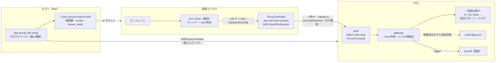

# 設計: EC2 の中を調べる（SSH over SSM + 診断ゲートウェイ）

調査コンテナのエージェントが、対象 EC2 インスタンスの OS 内部（ログ・サービス状態・リソース状況）を
調べられるようにする機能の設計。**未実装の提案**であり、実装後は `security.md` と `README.md` に反映する。

## 1. 目標と方針

やりたいこと。

- Apache / nginx / アプリケーションのログ、systemd の状態、`ps` / `free` / `df` / `ss` / `sar` / journal による調査
- 削除・変更・再起動・プロセス停止・任意の `sudo` は、そもそも実行できない
- **セットアップは強い権限の人間が 1 コマンド**。鍵の生成・配布・sshd の設定まで含めて自動化する
- ログインユーザー名は任意に選べる
- 調査の実行は調査コンテナから。鍵もコンテナから使える
- EC2 に残すものは目立たない名前にする。後片付けで消すが、それまでの間も「AI 用」と分かる名前を付けない

方針は既存の aws-survey と同じ。**安全性をエージェントの自制に依存させない**。EC2 側で「読めるもの」と
「実行できる診断」を決め、それ以外は存在しない。プロンプトとフックは事故防止の層であり、境界ではない。

読み取りの範囲は「**誰の権限で読むか**」で 2 段に分ける（§5）。

| 段 | 権限 | 範囲 | 守り |
| --- | --- | --- | --- |
| 一般読み取り | ログインユーザー自身 | 任意パスの一覧・閲覧・検索 | OS の権限 + 拒否パターン + マスク + 資源上限 |
| root 読み取り | `sudo diag-root` | 登録済みログと固定の診断だけ | 許可リスト。広げない |

読み取り専用のアカウントを渡された運用担当者ができることを一般読み取り段に置き、root だけを診断 API に閉じ込める。
調査の現実（ログの場所は事前に分からない、`ls` / `stat` / `du` が調査の半分）と、
OS の権限モデルが最初から効いていること（`/etc/shadow`・`/root`・他人の `~/.ssh` は一般ユーザーに読めない）を踏まえた線引き。

既存設計からの意図的な変更が 1 つある。既存は `logs:GetLogEvents` や `s3:GetObject` を Deny して
**ログ本文を見せない**立場だが、この機能はログ本文を読むことが目的である。秘匿らしき値をマスクするが、
マスクは経験則である。`security.md` に明記する（userData と同じ扱い）。

## 2. 名前

EC2 に残すものの名前はすべて `diag` で統一する。「ai」「agent」「survey」を含めない。
汎用の診断用アカウントに見える名前にし、後片付けで `aws-survey ssh remove` が一括で消す。

| もの | 名前 |
| --- | --- |
| ログインユーザー（既定。`--user` で変更可） | `diag` |
| ゲートウェイ | `/usr/local/lib/diag/gateway` |
| root ヘルパー | `/usr/local/lib/diag/diag-root` |
| 設定 | `/etc/diag/diag.conf` |
| sshd 設定 | `/etc/ssh/sshd_config.d/diag.conf` |
| sudoers | `/etc/sudoers.d/diag` |
| journal のタグ | `diag-gateway` |
| ロック | `/run/diag.lock`（再作成の定義は `/etc/tmpfiles.d/diag.conf`） |
| EC2 のタグ | `diag:ssh=<name>` |
| IAM ポリシー | `diag-ssh-<name>`（ロール名は既存の `auth.role_name` のまま） |

`<name>` は `environment.json` の `name`（対象フォルダごとの短い英数字名）。タグと IAM ポリシーは AWS 側に残るもので、
ロール自体が調査用と分かる名前を既に持っているため、ここまで隠さない。

## 3. 全体像



守りは 4 層。上から順に「境界」で、下に行くほど「事故防止」。

| 層 | 何が守るか | エージェントが触れるか |
| --- | --- | --- |
| IAM | `ssm:StartSession` は `diag:ssh=<name>` タグ付きインスタンスと `AWS-StartSSHSession` だけ | 触れない |
| sshd + 鍵 | `Match User` で ForceCommand・pty 禁止・転送禁止。鍵は `restrict,command=` 付き | 触れない |
| ゲートウェイ | 動詞と引数の検証。シェルを経由しない。資源上限。root は固定動詞だけ。journal に記録 | 触れない（root 所有） |
| コンテナのフック | `ssh` / `scp` の直接実行を拒否し、`ec2` ラッパーだけ通す。監査ログ | 触れない（root 所有）だが境界ではない |

二要素になっている点が重要。**一時キーだけでは鍵が無いので入れず、鍵だけでは IAM が無いので届かない。**

## 4. セットアップ（ホスト）

### 4.1 コマンド

```bash
aws-survey ssh setup <instance-id | Name タグ> [--user <name>] [--log <名前>=<パス or glob>]... [--deny <glob>]... [--strict]
aws-survey ssh setup --print [...]          # 導入スクリプトを標準出力に出すだけ（手動実行用）
aws-survey ssh list                         # 登録済みホストと導入状態
aws-survey ssh verify <host>                # コンテナから自己診断を打つ（§7）
aws-survey ssh rotate                       # 鍵を作り直し、登録済みホスト全部に再導入
aws-survey ssh remove <host>                # ユーザー・sshd 設定・sudoers・ゲートウェイ・設定を撤去し、タグを外す
```

- `--log` は root 読み取り段に登録するログ。一般ユーザーで読めるログには不要（§5.3）。
- `--deny` は一般読み取り段の拒否パターンに足す glob。ホスト固有の秘密の置き場を隠すため。
- `--strict` は一般読み取り段を無効にし、登録済みログと固定診断だけにする。感度の高いホスト向け。

`setup` は冪等。2 回目は鍵・ゲートウェイ・設定を上書きするだけで、ユーザーは作り直さない。
引数なしの `aws-survey` は、`environment.json` に `ssh.hosts` があれば `status` に表示するだけで、
セットアップを段階に組み込まない（EC2 調査は任意の追加機能）。

### 4.2 setup が行うこと

元プロファイル `auth.source_profile`（MFA 済み・強い権限）で実行する。調査コンテナには持ち込まない。

1. **前提確認**: `ssm describe-instance-information` で対象が SSM 管理下（`PingStatus=Online`）か見る。
   そうでなければ、インスタンスプロファイルに `AmazonSSMManagedInstanceCore` が要ることを案内して終わる。
   ここだけは自動化しない（他人のインスタンスの IAM を勝手に変えない）。
2. **鍵の生成**: `$AWS_DIR/ssh/id_ed25519` が無ければ `ssh-keygen -t ed25519 -N '' -C diag` で作る。
   対象フォルダ（`name`）ごとに 1 対。既存の一時キーと同じ場所なので、コンテナへは同じ ro マウントで渡る。
   鍵のコメントにも `<name>` を入れない（authorized_keys に残るため）。
3. **導入スクリプトの生成**: `libexec/ec2/install.sh.tmpl` に、ユーザー名・公開鍵・ゲートウェイ本体・
   `diag-root`・ログ登録・拒否パターン・strict フラグを埋め込んだ 1 本の bash を作る（§5）。
4. **SSM RunCommand で実行**: `ssm send-command --document-name AWS-RunShellScript` で root 実行し、
   `get-command-invocation` で完了を待つ。標準出力の末尾にある `HOSTKEY <type> <base64>` 行を回収する。
   - `--print` のときはここを飛ばし、スクリプトを出力して終わる。SSM 管理下でない・別経路の管理がある場合の逃げ道。
5. **タグ付け**: `ec2 create-tags` で `diag:ssh=<name>` を付ける。IAM 側の条件はこのタグを見る。
6. **クライアント設定の生成**: `$AWS_DIR/ssh/config` と `known_hosts` を書く。

   ```
   Host web1
       HostName i-0123456789abcdef0
       User diag
       IdentityFile ~/.aws-claude/ssh/id_ed25519
       IdentitiesOnly yes
       ProxyCommand aws ssm start-session --target %h --document-name AWS-StartSSHSession --parameters portNumber=%p
       StrictHostKeyChecking yes
       UserKnownHostsFile ~/.aws-claude/ssh/known_hosts
       BatchMode yes
       RequestTTY no
       ForwardAgent no
       ServerAliveInterval 15
   ```

   `known_hosts` の行は `i-0123... <type> <base64>`。SSM 経由でも中間者を排除できる（手順 4 で root から直接回収した鍵）。
7. **記録**: `environment.json` の `ssh.hosts.<alias>` に instance_id・user・logs・deny・strict・installed_at を書く。

### 4.3 導入スクリプトの大きさ

`AWS-RunShellScript` の `commands` に渡す。第 2 段で組み立てた 1 本は約 65 KB（ゲートウェイと `diag-root` を素の heredoc で含む）。
SSM の公開されている上限は「ドキュメント 64 KB」で、`SendCommand` は `MaxDocumentSizeExceeded` を返す。パラメータ値そのものの上限は
文書に明記されておらず、**実 AWS で第 3 段のときに実測する**。超えるときは gzip + base64（約 18 KB になる）を 1 つの heredoc で渡し、
EC2 側で展開して実行する。S3 経由は使わない（調査側で `s3:GetObject` を Deny している設計と噛み合わないし、余計なバケットを作りたくない）。

### 4.4 environment.json

```json
"ssh": {
  "user": "diag",
  "hosts": {
    "web1": {
      "instance_id": "i-0123456789abcdef0",
      "installed_at": "2026-09-09T10:00:00+09:00",
      "logs": { "app": "/var/www/app/log/*.log" },
      "deny": ["/var/www/app/config/*"],
      "strict": false
    }
  }
}
```

- `ssh.user` の既定は `diag`。`--user` で変える。検証は `^[a-z_][a-z0-9_-]{0,31}$`。
  `init` の 9 項目には足さない（EC2 調査は任意機能なので `setup` 時に決める）。
- `load-env.sh` は `SSH_USER` と `SSH_HOSTS`（alias の一覧）を読むだけ。

### 4.5 導入スクリプトが EC2 に作るもの

| 置き場 | 内容 | 所有 / 権限 |
| --- | --- | --- |
| `/usr/local/lib/diag/gateway` | ForceCommand の実体（Python 3、標準ライブラリのみ） | root / 755 |
| `/usr/local/lib/diag/diag-root` | root が要る少数の診断（Python 3） | root / 755 |
| `/etc/diag/diag.conf` | 登録済みログ、拒否パターン、strict | root / 644 |
| `/etc/ssh/sshd_config.d/diag.conf` | `Match User` ブロック（Include が無い古い sshd は `sshd_config` 末尾にマーカー付きで追記） | root / 600 |
| `/etc/sudoers.d/diag` | `diag-root` 1 本だけの NOPASSWD | root / 440 |
| `/etc/tmpfiles.d/diag.conf` | 再起動後に `/run/diag.lock` を作り直す 1 行（`/run` は tmpfs で、ログインユーザーは `/run` 直下に作れない） | root / 644 |
| `/run/diag.lock` | ゲートウェイの直列化ロック | root:<user のグループ> / 660 |
| `/home/<user>/.ssh/authorized_keys` | `restrict,command="/usr/local/lib/diag/gateway" ssh-ed25519 ...` | user / 600、ディレクトリ 700 |

導入スクリプトの手順。

1. ユーザー作成: `useradd --system --create-home --shell /bin/bash <user>`。
   対話ログインは sshd 側の `PermitTTY no` と ForceCommand で塞ぐ。シェルを `nologin` にすると ForceCommand も
   動かなくなるはずなので `/bin/bash` にする（実装時に確認）。パスワードはロックのまま。
2. 読み取りのためのグループ: `adm`、`systemd-journal` があれば追加。これで Debian 系の `/var/log` と journal は
   一般読み取り段で読める。Amazon Linux の `/var/log/messages` / `secure` は root 専用なので、自動検出して root 読み取り段に登録する。
3. ファイル配置と権限（上の表）。
4. sshd 設定。

   ```
   Match User diag
       ForceCommand /usr/local/lib/diag/gateway
       PermitTTY no
       DisableForwarding yes
       PermitTunnel no
       PermitUserRC no
       AuthenticationMethods publickey
       PasswordAuthentication no
   ```

   `sshd -t` で検証してから `systemctl reload sshd`。**restart ではなく reload**（既存セッションを落とさない）。
   検証に失敗したら書いた設定を戻して非ゼロで終わり、setup がそれを表示する。sftp サブシステム要求も
   ForceCommand に置き換わるため、scp / sftp は同時に塞がる。
   Ubuntu 24.04 のように sshd がソケット起動で常駐していないときは reload する対象が無く、次の接続から新しい設定が効く。
5. sudoers: `<user> ALL=(root) NOPASSWD: /usr/local/lib/diag/diag-root` と `Defaults:<user> !requiretty`。
   `visudo -c` で検証してから置く。
6. `diag.conf` の生成（§5.3 の自動検出 + `--log` + `--deny` + strict）。
7. 動作確認: `sudo -u <user> /usr/local/lib/diag/gateway` を `SSH_ORIGINAL_COMMAND=uptime` で叩いて成功、
   `SSH_ORIGINAL_COMMAND='bash'` で拒否されることを確かめる。
8. 最後に `HOSTKEY` 行を出す: `for f in /etc/ssh/ssh_host_*_key.pub; do echo "HOSTKEY $(cut -d' ' -f1,2 $f)"; done`。

対応 OS は Amazon Linux 2 / 2023、Ubuntu 20.04 以降、Debian 11 以降。パッケージの導入はしない
（`sar` が無ければ `sar` 動詞は「未導入」と返す。本番機に勝手に入れない）。

## 5. ゲートウェイの仕様

### 5.1 原則

- 入力は `SSH_ORIGINAL_COMMAND` の 1 本だけ。`shlex.split` で分解し、**検証済みの argv を `subprocess.run` に list で渡す**。
  `shell=True` も `bash -c` も使わない。`;` `|` `$()` は、そもそも解釈する層が無い。
- 未知の動詞・未知のオプション・書式に合わない値は、理由を 1 行返して終了コード 2。
- すべて `timeout 30`（`journal` / `grep` / `find` / `du` は 60）、`nice -n 19` + `ionice -c 3`、
  出力は 1 MiB で打ち切って末尾に `[truncated]` を付ける。同時実行は `/run/diag.lock` の `flock` で 1 本。
- 実行前に `logger -t diag-gateway "<user> <verb> <args> allow|deny:<reason>"` で journal に記録する。
  この記録はエージェントが触れない場所にある。
- 一般読み取り段のファイル内容には、拒否パターン（§5.4）とマスク（§5.5）を掛ける。
- root 読み取り段（`diag-root`）は固定動詞と登録済みログだけ。任意パスは今後も足さない。

### 5.2 動詞と引数

#### 一般読み取り段（ログインユーザーの権限で実行。`--strict` では無効）

パスは絶対パスのみ。`os.path.realpath` で正規化してから拒否パターンと照合する（シンボリックリンク経由の迂回を防ぐ）。

| 動詞 | 実行するもの | 引数 |
| --- | --- | --- |
| `ls <path>` | `ls -la --time-style=long-iso` | `--recursive`（深さ ≤3、件数 ≤2000） |
| `find <dir>` | `find <dir> -maxdepth N -name <pat> [-newermt <date>] [-size +N]` | `--name <glob ≤80 字>`、`--depth N`（≤5、既定 3）、`--newer <日時>`、`--larger <size>`。`-exec` 等は無い |
| `stat <path>` | `stat` | なし |
| `du <dir>` | `du -sh` と `du -d 1 -h \| sort -h` の上位 | `--depth 1\|2` |
| `cat <path>` | 全体（≤1 MiB。超える場合は先頭と末尾を出して案内） | なし |
| `head <path>` / `tail <path>` | `head -n N` / `tail -n N`。`.gz` は `zcat` | `--lines N`（≤5000、既定 200） |
| `grep <path>...` | `grep -E -n --` を 1 ファイルずつ、`-r` は `--recursive` のときだけ深さ制限付き | `--pattern <ERE ≤200 字>`、`--context N`（≤5）、`--ignore-case`、`--recursive`、`--max N`（≤2000、既定 500） |

#### 固定診断（ログインユーザーの権限。strict でも使える）

| 動詞 | 実行するもの | 引数 |
| --- | --- | --- |
| `uptime` | `uptime` | なし |
| `os` | `/etc/os-release`、`uname -a`、`hostnamectl` | なし |
| `ps` | `ps -eo pid,ppid,user,%cpu,%mem,rss,etime,stat,args --sort=-%cpu` | `--top N`（≤500、既定 100）、`--sort cpu\|mem` |
| `proc <pid>` | `/proc/<pid>/status`、`limits`、`fd` の数、`cmdline` | pid は数字のみ。**`environ` は出さない** |
| `free` | `free -m` | なし |
| `vmstat` | `vmstat 1 N` | `--count N`（≤10、既定 5） |
| `df` | `df -hT` と `df -ih` | なし |
| `sar <種別>` | `sar -u` / `-r` / `-b` / `-n DEV` / `-q`、`-f` で当日と前日 | `cpu\|mem\|io\|net\|load`、`--day today\|yesterday` |
| `net` | `ip -br addr`、`ip route`、`ss -tuln`（`-p` 無し） | なし |
| `services` | `systemctl list-units --type=service --all --no-pager` | なし |
| `failed` | `systemctl --failed --no-pager` | なし |
| `service <unit>` | `systemctl status <unit> --no-pager -l -n 50` | unit は `^[A-Za-z0-9@._-]{1,80}$` |
| `unit <unit>` | `systemctl cat <unit>` | 同上 |
| `timers` | `systemctl list-timers --all --no-pager` | なし |
| `journal [unit]` | `journalctl -u <unit> --since <dur> -n N --no-pager -o short-iso` | `--since 30m\|2h\|1d`（≤7d）、`--lines N`（≤5000、既定 500）、`--grep <pat>`、`--priority err`。グループで読めなければ root 段へ |
| `logs` | `diag.conf` の登録済みログと実ファイル（ローテート済み含む）とサイズ | なし |
| `help` | 動詞一覧とこの表の要約 | なし |

#### root 読み取り段（`sudo diag-root`。動詞はこの 5 つで固定）

| 動詞 | 実行するもの | 引数 |
| --- | --- | --- |
| `listeners` | `ss -tulpn`（他ユーザーのプロセス名を出すため root） | なし |
| `dmesg` | `dmesg -T` の末尾 | `--lines N`（≤2000） |
| `cron` | `/etc/crontab`、`/etc/cron.d/*`、各ユーザーの `crontab -l` | なし |
| `journal [unit]` | 上と同じ。グループで読めないときだけ | 上と同じ |
| `log <名前>` | 登録済みログの `tail -n N` → `grep -E`。`.gz` は `zcat` | `--tail N`（≤5000）、`--grep`、`--file <logs が出した実名>`、`--context N` |

将来 Docker ホスト向けに `containers`（`docker ps`）と `clog <name>`（`docker logs --tail N`）をここに足す。
docker グループは root 相当なので、一般読み取り段には置かない。

意図的に無いもの: `tail -f`、`top`、`strace`、`tcpdump`、`curl`、`env`、`proc <pid> environ`、任意パスの root 読み取り。

### 5.3 登録済みログ（diag.conf）

root 読み取り段の `log` 動詞が読める範囲。一般ユーザーで読めるログは登録しなくても `tail` / `grep` で読める。
導入スクリプトが root 専用のものを自動検出する。

| 論理名 | 実パス |
| --- | --- |
| `messages` / `secure` | `/var/log/messages*` / `/var/log/secure*`（Amazon Linux） |
| `syslog` / `auth` | `/var/log/syslog*` / `/var/log/auth.log*`（`adm` で読めなければ） |
| `nginx-*` / `httpd-*` | `/var/log/nginx/*`、`/var/log/httpd/*`（root 専用のときだけ） |

`setup --log app=/var/www/app/log/*.log` で足す。glob は**ディレクトリまで**が確定していることを要求し、
`..` と `*` をディレクトリ部分に含めない。`diag-root` は実行時にこの glob を展開し、
展開結果の外にあるパスは決して開かない（`--file` の値は展開結果と照合する）。

### 5.4 拒否パターン（一般読み取り段）

名前とパスで判定する。`ls` の一覧には名前が出るが、`cat` / `head` / `tail` / `grep` / `find --name` の対象にはならない。

- ファイル名: `.env`、`.env.*`、`*.pem`、`*.key`、`*.p12`、`*.pfx`、`id_rsa*`、`id_ed25519*`、`id_ecdsa*`、`*secret*`、`*credential*`、
  `*password*`、`*.keystore`、`*.jks`、`wp-config.php`、`database.yml`、`secrets.yml`、`master.key`、`.htpasswd`、`.netrc`、`.pgpass`、`.my.cnf`
- ディレクトリ: `/root`、`/home/*/.ssh`、`/home/*/.aws`、`/home/*/.gnupg`、`/etc/ssh`、`/etc/diag`、`/etc/sudoers*`、`/etc/shadow*`、
  `/etc/letsencrypt/live`、`/etc/letsencrypt/archive`、`/var/lib/docker`、`.git/`、`/proc/*/environ`、`/proc/*/mem`、`/dev`、`/sys/firmware`
- 拡張子: `*.sqlite`、`*.sqlite3`、`*.db`（データ本体。既存の DynamoDB / RDS の Deny と同じ立場）
- `setup --deny <glob>` の追加分

網羅はできない。**OS の権限で読めない場所はここに載っていなくても読めない**ので、このリストが担うのは
「一般ユーザーが読めるように置かれてしまった秘密」だけ。それは `security.md` に「保証しないこと」として書く。

### 5.5 マスク

一般読み取り段のファイル内容と、root 段の `log` / `cron` の出力に、以下を `***` で置き換える。

- `(password|passwd|secret|token|api[_-]?key|private[_-]?key)\s*[:=]\s*\S+`（大文字小文字を無視）
- `Authorization:\s+\S+\s+\S+`
- `AKIA[0-9A-Z]{16}`、`aws_secret_access_key\s*=\s*\S+`
- `-----BEGIN [A-Z ]*PRIVATE KEY-----` から `END` まで
- URL のユーザー情報 `://[^/@\s]+:[^/@\s]+@`

これで漏れないとは言わない。`security.md` に「経験則」と書く。

### 5.6 diag-root

`sudo` で呼ばれる側。動詞は §5.2 の 5 つに固定し、それ以外は終了コード 2。
引数はゲートウェイと**同じ検証コードを持ち、もう一度検証する**（ゲートウェイを信用しない）。
環境変数は `env_reset` の既定に任せ、`PATH` は固定する。

`journal` は、グループで読めるならゲートウェイ自身が読み、`PermissionError` のときだけ `diag-root` に回す。
root で動く回数を最小にするため。

## 6. IAM と一時キー

`ssm:StartSession` は `ReadOnlyAccess` に無い。**Deny のみ**だった `session-guard.json` の設計は変えず、
`--policy-arns` に顧客管理ポリシーを 1 つ足す。

- `aws-survey role --create` が `diag-ssh-<name>` ポリシーを作り、調査用ロールにアタッチする。
- `aws-survey credentials` が `--policy-arns` に `ReadOnlyAccess` と並べて渡す。
  ロール側とセッション側の両方に Allow が要る（有効な権限は両者の積）。

```json
{
  "Version": "2012-10-17",
  "Statement": [
    {
      "Effect": "Allow",
      "Action": "ssm:StartSession",
      "Resource": "arn:aws:ec2:*:<account>:instance/*",
      "Condition": { "StringEquals": { "ssm:resourceTag/diag:ssh": "<name>" } }
    },
    {
      "Effect": "Allow",
      "Action": "ssm:StartSession",
      "Resource": "arn:aws:ssm:*:*:document/AWS-StartSSHSession"
    },
    {
      "Effect": "Allow",
      "Action": ["ssm:TerminateSession", "ssm:ResumeSession"],
      "Resource": "arn:aws:ssm:*:*:session/${aws:userid}-*"
    }
  ]
}
```

`AWS-StartSSHSession` は 22 番ポートを生で通すだけで、認証は sshd が行う。IAM だけではシェルは取れない。
`ssm:SendCommand` は与えない（導入はホストの元プロファイルの仕事）。

## 7. 検証

`aws-survey verify` に 2 項目を足す。

- タグ無しのインスタンスに `start-session` が拒否される（`AccessDeniedException`）
- `AWS-StartInteractiveCommand` / `AWS-StartPortForwardingSession` が拒否される

`aws-survey ssh verify <host>` は SSH 側の検証で、`docker run ... ec2 --selftest <host>` としてコンテナから打つ
（ホストの Mac に session-manager-plugin を入れなくて済む）。確認するもの。

- `ec2 <host> uptime` が通る
- `ssh <host> bash`、`ssh <host> 'uptime; id'`、`ssh <host> 'cat /etc/passwd'`、`ssh -t <host>`、`ssh -L`、`sftp <host>` が拒否される
- `ec2 <host> cat /etc/shadow` が OS 権限で失敗し、`ec2 <host> cat /etc/ssh/sshd_config` が拒否パターンで失敗する
- `ec2 <host> ls /home/<user>/.ssh` は一覧が出るが、`cat` すると拒否される
- `ec2 <host> log messages --tail 3` が root 段で読める（登録が効いている）
- `ec2 <host> proc 1 environ` が拒否される
- `--strict` のホストでは `ec2 <host> cat /etc/hosts` が拒否される

## 8. 調査コンテナ側

### 8.1 追加する部品

| 部品 | 置き場 | 役割 |
| --- | --- | --- |
| `session-manager-plugin` と `openssh-client` | `Dockerfile` | `aws ssm start-session` の実体。AWS の deb を arch 別に入れる |
| `ec2` ラッパー | `container/ec2` → `/usr/local/bin/ec2`（root 所有） | `ssh -F ~/.aws-claude/ssh/config -- <host> <argv>` を組む。オプションは一切受け取らず、`<host>` は config の `Host` と照合 |
| フックの追加 | `container/hooks/aws-readonly-guard.sh` | `ssh` / `scp` / `sftp` / `session-manager-plugin` の直接実行を拒否。`ec2 ` で始まる単独コマンドは、`aws` と同じ「`> out/…` だけ許す」規則で通す。監査ログに記録 |
| `method/06_EC2の中を調べる.md` | `container/method/` | 動詞の使い方。`ls` / `find` で場所を突き止めてから `tail` / `grep`、大きい出力は `raw/` に落とす、の作法 |
| `survey-status` | `container/survey-status` | 登録済みホストを表示 |

鍵の置き場は `~/.aws-claude/ssh/`（ホストの `$AWS_DIR/ssh/` の ro マウント）。**コンテナの中から使えるが、
コンテナの中では作れず、消せず、書き換えられない**。既存の一時キーとまったく同じ扱い。
鍵の作り直しはホストの `aws-survey ssh rotate` だけが持つ。

`ec2` ラッパーは、ユーザーからの入力を `ssh` の引数として**位置固定**で渡す。

```bash
exec ssh -F "$HOME/.aws-claude/ssh/config" -- "$host" "$(printf '%q ' "$@")"
```

`ssh` はリモート側の文字列を 1 本で送るので、ここで `%q` で量子化し、ゲートウェイが `shlex.split` で戻す。

### 8.2 フックの判定

```
ec2 <host> <verb> [args...] [> out/<相対パス>.(txt|json)]
```

- `ec2` は単独コマンドのみ。パイプ・連結・`$()` は `aws` と同じ理由で拒否（保存は `> out/…` だけ）。
- `ssh`、`scp`、`sftp`、`session-manager-plugin`、`aws ssm start-session` は常に拒否（後者は `start-` が読み取り動詞でないため既に落ちる）。
- `.aws-claude/ssh` への言及は、既存の `credentials|config` の判定に `ssh/` を足して拒否する。

## 9. security.md に足すこと

- EC2 調査は**ログ本文を読む**。既存の CloudWatch Logs の Deny と方針が違う理由。
- 読み取りは 2 段。一般読み取り段は OS の権限が境界で、拒否パターンとマスクはその内側の事故防止。
  root 読み取り段は許可リストが境界で、任意パスは無い。
- 保証しないこと: 一般ユーザーが読める場所に置かれた秘密は、拒否パターンとマスクをすり抜けうる。
  本番機の負荷はゼロではない（上限は掛ける）。ゲートウェイが動く OS の範囲。
- 二要素（IAM + 鍵）と、それぞれが単独では届かないこと。
- EC2 側の journal 記録は、コンテナの監査ログと違ってエージェントが触れない証跡であること。
- 感度の高いホストは `--strict` と `--deny` で絞れること。

## 10. 実装の順序と検証

1. `libexec/ec2/gateway.py` と `diag-root.py`。**済**。ローカルで動く（Mac でも Python 標準ライブラリだけで解析部分はテストできる）。
   `tests/test_gateway.py` に、動詞ごとの許可・拒否・引数上限・拒否パターン（realpath 経由のシンボリックリンクを含む）・
   `shlex` 迂回（`'uptime; id'`、`$(id)`、改行）を書く。
2. 導入スクリプトの雛形と `aws-survey ssh setup --print`。EC2 を使わず、ローカルの Docker（Ubuntu / AL2023）で
   root 実行して sshd 設定と権限を確かめる。**済**（`libexec/ec2/install.sh.tmpl`・`libexec/commands/ssh.sh`・
   `tests/test_ssh_install.py`。Docker での確認は `tests/ec2_install_smoke.sh`）。
3. `aws-survey ssh setup`（SSM 経由）と `known_hosts` の回収。実 EC2 が要る。
4. IAM ポリシーと `role` / `credentials` / `verify` の追加。実 AWS が要る。`PackedPolicySize` を再確認する。
5. Dockerfile・`ec2` ラッパー・フック・`test_guards.py`。
6. `method/06`、`survey-status`、`security.md`、`README.md`。

実環境で未確認のまま完了扱いにしない項目と、いまの状態。

| 項目 | 状態 |
| --- | --- |
| `/bin/bash` と ForceCommand の組み合わせ | ローカル Docker の sshd（Ubuntu 24.04 / AL2023）で、鍵認証 → ForceCommand → ゲートウェイの許可と拒否まで確認。実 EC2 では未確認 |
| SSM パラメータの上限 | 未確認。生成物は約 65 KB で、公開されている「ドキュメント 64 KB」と同じ桁（§4.3） |
| AL2 の `requiretty` | 未確認（AL2023 では `requiretty` が無く、AL2 のイメージでは確認していない）。sudoers に `Defaults:<user> !requiretty` を書いてある |
| session-manager-plugin の deb の arm64 対応 | 未確認（第 5 段） |
