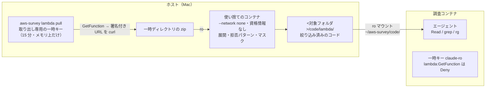

# 設計: Lambda のコードを読む（草案）

調査コンテナのエージェントが、対象の Lambda 関数に**デプロイされているコード**を読めるようにする機能の設計。
構成調査（`ReadOnlyAccess` + Deny のみのセッションポリシー）と EC2 の中の調査（`docs/design-ec2-ssh.md`）に続く 3 つ目の経路。
**草案。未実装。** 第 11 節の「決めること」が決まってから第 10 節の順に進める。

## 1. 目標と方針

やりたいこと。

- 関数が何をしているかを、ソースコードから読む。ハンドラの入口、呼んでいる AWS サービスとリソース名、
  使っている環境変数の名前、外部への接続先、例外の扱い
- 設定（`get-function-configuration`）・トリガー・ロールの権限と、コードの中身を突き合わせる
- Python / Node.js / Ruby のような**ソースがそのまま載る言語**を主対象にする。Java / Go / .NET のような
  コンパイル済みのものは、読める範囲（設定ファイル・依存の一覧・クラスや関数の名前）までにする（§5.5）

やらないこと。

- **関数を起動しない。** `lambda:InvokeFunction` は使わず、取り出したコードを手元で実行もしない。
  調査コンテナでは `node` / `python3` の実行が最初から禁止されており、取り出したコードはここでも動かない
- 対象の AWS に何かを置かない。EC2 の経路と違い、診断用の部品もタグもポリシーも作らない
- コンテナイメージ形式の関数の中身（§5.6）。ECR から pull する権限は一時キーに無い

方針は既存と同じ。**安全性をエージェントの自制に依存させない。** 調査エージェントが目にするのは、
拒否パターンとマスクを通したあとのコードだけにする。生のコードは調査コンテナに届かない。

既存設計からの意図的な変更が 1 つある。第 1 節（`docs/security.md`）は `codecommit:GitPull` を
「ソースコード全体」として Deny しているが、この機能はソースを読むことが目的である。範囲は
**デプロイされた成果物だけ**（履歴・ブランチ・未デプロイのコードは含まない）で、`codecommit:GitPull` の Deny は変えない。
EC2 の経路がログ本文について方針を変えたのと同じ扱いで、`security.md` に明記する。

## 2. どこで取り出すか

コードの取り出しは `lambda:GetFunction` の応答にある `Code.Location`（S3 の署名付き URL。AWS の文書では 10 分有効）から行う。
`ReadOnlyAccess` に含まれ、**いまの一時キーでも取得できる**（2026-09-11 にフックで確認。`aws lambda get-function` は通る）。
いまそれを止めているのは、調査コンテナの `curl` / `wget` / `python3` の禁止だけである。しかもこの禁止は Bash ツールにしか掛かっておらず、
Claude Code の `WebFetch` ツールは `settings.json` で拒否されていない。署名付き URL を `WebFetch` に渡せば、フックを通らずに
zip の中身（の要約）が届く。§6.1 と §7 で塞ぐ。

取り出す場所の候補は 2 つあった。

| 案 | 流れ | 生のコードに誰が触れるか | 採否 |
| --- | --- | --- | --- |
| A. 調査コンテナのラッパー | `lambda <関数> cat <path>` のようなラッパーが、呼ばれるたびに取得・展開・マスクして返す | 調査コンテナの `node` ユーザー。コンテナに `sudo` は無く、ラッパーが書いた一時ファイルもキャッシュも、エージェントと同じユーザーで読める。境界は Claude Code / Codex の設定とフックだけになる | 採らない |
| B. ホストで取り出し、絞り込んだものを渡す | ホストの `aws-survey lambda pull` が取得し、使い捨てのコンテナで展開・絞り込み、結果を調査コンテナに読み取り専用でマウントする | ホストと使い捨てのコンテナだけ。調査コンテナの一時キーではコードの URL を取れない（§6.1） | **採る** |

B を採る理由。

- 境界が権限にある。調査コンテナの一時キーは `lambda:GetFunction` を Deny され、コードの URL をそもそも受け取れない。
  A ではラッパーの外から同じ API を叩けば生のコードに届き、止めるのはフックだけになる
- 調査エージェントが普段の道具（Read・`grep`・`rg`）でコードを読める。動詞の設計も上限の調整も要らない
- 取り出しは関数ごとに 1 回で済む。A は読むたびに最大 50 MB（zip）を取り直す
- ホストの仕事は「用意」に留まる。`aws-survey ssh setup` と同じく、起動の前（または途中）に人間が 1 コマンドを打つ

代わりに、調査の途中でコードが欲しくなったら、調査エージェントはユーザーにホストでの `pull` を頼むことになる。
`--all` で対象リージョンの全関数を一度に取れるので、多くの場合は最初に 1 回で済む。

## 3. 全体像



## 4. ホストのコマンド

### 4.1 コマンド

```
aws-survey lambda pull <関数名>... [--region <r>] [--with-deps]
aws-survey lambda pull --all [--region <r>] [--with-deps]
aws-survey lambda list
aws-survey lambda remove <関数名>... | --all
```

- `pull` はリージョンの既定を `environment.json` の `region` にする。`--all` はそのリージョンの `ListFunctions` の全件
  （ページングは `aws` の自動ページングに任せ、`--max-items` を書かない）。
  同じ `CodeSha256` の関数は取り直さない（§11 の「古い版」を参照）。途中で止まっても、もう一度打てば残りだけ進む
  （一時キーの 15 分を超える `--all` は、これで最後まで行く）
- 取るのは `$LATEST` と、**エイリアスが指す版**。`$LATEST` は未公開の作りかけであることがあり、実際に呼ばれているのは
  エイリアス（`live`・`prod`）の先の公開版という構成が多い。`ListAliases` で版を集め、`$LATEST` と `CodeSha256` が違う版だけ
  `<関数名>/<版>/` に別に置く。同じならエイリアス名と版番号を `_manifest.json` に控えるだけにする
- `list` はホストに取り出してある関数・リージョン・`CodeSha256`・取り出した日時・除外した件数を出す。AWS は叩かない
- `remove` はホストの取り出し先を消す。AWS には何も残していないので、AWS 側の片付けは無い
- 表示は `libexec/ui.sh` の部品で組む（`.agents/rules/credentials.md`）。`ssh` と同じく任意機能で、段階の判定には組み込まない

### 4.2 pull が行うこと

1. 元プロファイルが有効であることを確かめる（`credentials` と同じ判定。切れていれば `refresh_command` を案内）
2. 取り出し専用の一時キーを発行する（§6.2）。ファイルには書かず、このプロセスの環境変数にだけ持つ
3. 関数ごとに `get-function` を呼び、設定（ランタイム・ハンドラ・レイヤー・`PackageType`・`CodeSha256`・`ImageUri`・エイリアスと版）を控える。
   **`get-function` と `list-functions` の応答には環境変数の値が入る。** `--query` で要る項目だけ取り、応答の全文をファイルにも
   画面にも出さない。`_manifest.json` に環境変数は名前だけ置く（値は調査コンテナが `get-function-configuration` で
   マスクの指示のもとに読む。ここで別経路を作らない）。`Code.Location` の URL も同じく表示・記録しない（署名を含む）
4. `PackageType` が `Zip` なら、`Code.Location` をホストの `curl` でホストの一時ディレクトリに落とす（`--max-filesize` で
   zip の上限 50 MB を掛ける。URL は引数ではなく `--config -` か `-K` で標準入力から渡し、`ps` に出さない）。
   `Image` なら落とさず、控えだけ残す（§5.6）
5. 参照しているレイヤーの版ごとに `get-layer-version-by-arn` を呼び、同じく落とす。同じ版は 1 回だけ
6. 使い捨てのコンテナで展開と絞り込みを行う（§5）
7. 一時ディレクトリを消す。**生の zip はホストにも残さない**

使い捨てのコンテナは、調査用イメージを Python の実行環境として借りるだけにする。イメージは `run.sh` の `build_image` が作るが、
`pull` は初回の `run` より前に打たれうる。`build_image` を `libexec/docker.sh` に出して `run` と `pull` の両方から呼ぶ
（`pull` が `docker image inspect` で無ければ `run` を先に、と案内するだけでも足りるが、`settings.json` や
フックの更新が `run` を通らないと届かないのは今と同じなので、共有して毎回ビルドする方が筋がよい）。

```bash
docker run --rm --network none --read-only --tmpfs /tmp \
  -v "$tmp/zips:/in:ro" -v "$dest:/out" \
  -v "$LIBEXEC_DIR/lambda/extract.py:/x/extract.py:ro" \
  -v "$LIBEXEC_DIR/ec2/gateway.py:/x/gateway.py:ro" \
  "$IMAGE" python3 /x/extract.py /in /out
```

- ネットワークも資格情報も渡さない。展開するのは対象のファイルで、zip の中身を信用しない（§5.1）
- 抽出器 `libexec/lambda/extract.py` はホスト側の部品で、調査コンテナのイメージには焼かない
- マスクと拒否パターンは `gateway.py` の `MASK_RULES` / `DENY_NAMES` を import して使う。写しを作らない
- ホストに `python3` の依存を増やさない（いまのホスト側は bash・`aws`・`jq`・`docker` だけ）。`curl` は `doctor` の確認項目に足す
- `/out` に書くのはコンテナの `node` ユーザー。Linux のホストでは取り出し先が uid 1000 所有になる。macOS（Docker Desktop）では気にしなくてよい。
  `_manifest.json` と `src/` はホストの利用者が読めればよく、調査コンテナからは ro なので実害は無いが、`remove` が消せることをテストで見る
- 失敗しても生の zip を残さないよう、一時ディレクトリの削除は `trap` で持つ

### 4.3 取り出し先

```
<対象フォルダ>/code/
  lambda/<region>/<関数名>/
    _manifest.json      設定の控え・CodeSha256・取り出した日時・除外したファイルと理由・依存の一覧・バイナリの一覧
    src/                絞り込み済みのコード
  lambda-layers/<region>/<レイヤー名>/<版>/
    _manifest.json
    src/
```

`out/` とは分ける。`out/` は調査の記録で、ここは読む材料である。調査の記録からは
`code/lambda/<region>/<関数名>/src/...` のパスと `CodeSha256` で参照する。

## 5. 展開と絞り込み

### 5.1 展開の安全

zip の中身は対象のものなので信用しない。

- `..` を含むパス・絶対パスの項目は展開しない（zip slip）
- シンボリックリンクの項目は実体化せず、`_manifest.json` にリンク先の文字列だけ残す
- 展開後の合計に上限を掛ける（Lambda の展開後の上限は 250 MB。それを超える zip は壊れているか意図的なものとして止める）。
  ヘッダの `file_size` は信用せず、実際に書いたバイト数で数える（zip bomb）。1 ファイルの上限も別に持つ（同じ値でよい）
- 展開先の tmpfs には大きさを指定する（`--tmpfs /tmp:size=1g` のように、上限より一回り大きい値）
- 展開はホストではなく、ネットワークの無い使い捨てのコンテナの `/tmp`（tmpfs）で行う

### 5.2 拒否パターン

`gateway.py` の `DENY_NAMES`（`.env`・`*.pem`・`*.key`・`*secret*`・`*credential*`・`*password*`・`*.jks`・`*.sqlite`・`*.db` など）と
`DENY_COMPONENTS`（`.git`）に一致するファイルは `src/` に置かない。`_manifest.json` に名前と理由だけ残す
（EC2 の `ls` が名前を見せるのと同じ立場。存在は分かり、中身は読めない）。

ただし `*secret*`・`*credential*`・`*password*` はサーバの設定ファイル向けの規則で、Lambda のコードにそのまま掛けると
`secrets.py`（Secrets Manager を読む側のコード）・`password_reset.js`・`credentials_provider.ts` のような、
**まさに読みたいファイル**を落とす。ソースコードの拡張子（`.py` `.js` `.mjs` `.cjs` `.ts` `.rb` `.java` `.go` `.cs` など。
`extract.py` が一覧を持つ）には名前の拒否を掛けず、マスク（§5.3）だけを掛ける。それ以外（`.env`・`.pem`・`.json`・`.yml`・
`.txt`・拡張子なし…）には今までどおり名前の拒否を掛ける。判定の違いは `_manifest.json` の理由に書く。

### 5.3 マスク

テキストとして読めるファイル（UTF-8 として解釈でき、NUL を含まない）に `MASK_RULES` を掛けて書く。
EC2 の経路と同じ規則で、同じく**経験則**である。コードに直書きされた秘密の多くは `password = "..."`・`api_key: ...`・
`AKIA...`・URL のユーザー情報の形をとるので効くが、変数名の無い定数やエンコードされた値はすり抜ける。

`MASK_RULES` の 1 つ目（`password|secret|token|api_key… = <空白でない列>`）は、コードでは
`password = os.environ["DB_PASSWORD"]` や `token = event["headers"]["authorization"]` も `password = ***` にする。
環境変数から取っているのか、リクエストから取っているのかは構成調査で知りたいことなので、ソースコードの拡張子では
この規則を**引用符で囲まれた文字列リテラルが右辺のときだけ**掛ける形に変える（`MASK_RULES_SOURCE` を `extract.py` 側で持つ。
`gateway.py` の規則は変えない）。他の規則（`AKIA`・秘密鍵・URL のユーザー情報・`aws_secret_access_key`）はそのまま掛ける。
リテラル以外への代入を素通しにする分、`base64` の定数や連結で組み立てた値は前と同じくすり抜ける（§9）。

### 5.4 依存ライブラリ

zip の大半は依存ライブラリで、読みたいのは関数自身のコードである。既定では依存を `src/` に置かず、名前と版を一覧にする。
`--with-deps` で依存も置く（拒否パターンとマスクは同じく掛かる）。

| ランタイム | 依存と判定するもの | 一覧の出どころ |
| --- | --- | --- |
| Node.js | `node_modules/` | `package.json`・`package-lock.json`（これらは `src/` にも置く） |
| Python | `*.dist-info/RECORD` に載っているパス（Python の zip は依存を直下に並べるので、ディレクトリ名では判定しない）・`*.dist-info/`・`*.egg-info/`・`__pycache__/` | `*.dist-info/METADATA` の Name と Version・`requirements.txt` |
| Ruby | `vendor/bundle/` | `Gemfile.lock` |

レイヤーは依存だけのことが多い。レイヤーにも同じ判定を掛け、`_manifest.json` に「関数自身のコードを含むか」を残す。

**バンドルされた Node.js 関数**（CDK の `NodejsFunction`・SAM の esbuild・Serverless Framework の既定）は、
`index.js` 1 本に依存も含めて固められており、`node_modules/` の判定が効かない。1 ファイルが数 MB・数行という形で、
そのままでは読めない。`*.js.map` に `sourcesContent` があれば、そこから元のソースを `src/_sources/<元のパス>` に戻す
（`node_modules/` 配下のパスは依存として同じく除外し、`--with-deps` で含める）。`sourcesContent` が無ければ、
`_manifest.json` に「バンドル済み・ソースマップ無し」と書き、バンドルは `src/` にそのまま置く（マスク済み。読めないことは読めないが、
`grep` で呼んでいるサービス名・環境変数名は拾える）。これは初版に入れる（§11）。

### 5.5 ソースが読めないもの

| 形 | `src/` に置くもの | `_manifest.json` に残すもの |
| --- | --- | --- |
| Java（`.jar` / `.class`） | jar の中の設定ファイル（`*.properties`・`*.yml`・`*.xml`。マスク済み）、`META-INF/MANIFEST.MF` | クラスの一覧（ハンドラのパッケージを先頭に）、`META-INF/maven/**/pom.properties` から依存と版 |
| Go / Rust などのカスタムランタイム（`bootstrap`） | なし | ファイル名・大きさ。Go なら埋め込みのビルド情報（モジュール名と依存） |
| .NET（`.dll`） | `*.deps.json`・`*.runtimeconfig.json`・`appsettings*.json`（マスク済み） | アセンブリの一覧 |
| その他のバイナリ | なし | 名前・大きさ・SHA-256 |

**逆コンパイルはしない**（初版）。JDK や逆コンパイラをイメージに入れると重く、読める形になるのは Java だけである。
クラスファイルの定数（文字列・メソッド名）の要約は、需要があれば後の段で足す（§10）。

### 5.6 コンテナイメージ形式の関数

中身は取り出さない。一時キーの `ecr:GetAuthorizationToken` は Deny されており、取り出し専用の一時キーにも足さない。
`_manifest.json` に `ImageUri`・`ResolvedImageUri`・`ImageConfigResponse`（Entrypoint / Command / WorkingDirectory）を残す。
中身が要るときは、対象の管理者にイメージの元のリポジトリを聞く、が調査エージェントの案内になる。

## 6. IAM と一時キー

### 6.1 調査コンテナの一時キーでコードの URL を取れなくする

`session-guard.json` に次を足す。

| Action | 何が出るか |
| --- | --- |
| `lambda:GetFunction` | `Code.Location`（関数のコードの署名付き URL） |
| `lambda:GetLayerVersion` | `Content.Location`（レイヤーの中身の署名付き URL）。`GetLayerVersionByArn` も同じ Action |

この機能を使わない対象でも足す。コードの URL が出力に出ること自体が、いまの設計の穴だからである（§2）。

`lambda:GetFunctionConfiguration`（設定・環境変数）は変えない。`GetFunction` を失って調査エージェントが取れなくなるのは
`Code`（`ImageUri` を含む）・タグ・同時実行数で、タグは `list-tags`、同時実行数は `get-function-concurrency` で取れる。
`ImageUri` は取り出していれば `_manifest.json` にある。`method/` にこの読み替えを書く。

フックにも同じ拒否を足す（二重の防御）。`aws cloudfront get-function`（CloudFront Functions のコード。`method/01` で使っている）と
名前が重なるので、動詞だけでなくサービスと組で判定する: `lambda get-function`・`lambda get-layer-version`・`lambda get-layer-version-by-arn`。
`get-function-configuration` などは通す。

`settings.json` の `deny` に `WebFetch` と `WebSearch` を足す。調査に外部の Web は要らず、署名付き URL に限らず
「AWS から得た URL を開く」経路そのものを閉じる（Codex 側は `web_search = "disabled"` で既に閉じている）。
これも機能の有無にかかわらず入れる。

`PackedPolicySize` を測る（`.agents/rules/credentials.md`）。

### 6.2 取り出し専用の一時キー

調査用ロールを、別のセッションポリシーで借りる。

```json
{
  "Version": "2012-10-17",
  "Statement": [{
    "Effect": "Allow",
    "Action": ["lambda:GetFunction", "lambda:GetLayerVersion", "lambda:ListFunctions", "lambda:ListAliases"],
    "Resource": "*"
  }]
}
```

- `--policy-arns` は渡さず、このインラインポリシーだけを渡す。有効な権限は「ロール（`ReadOnlyAccess`）∩ これ」で、
  Lambda の 4 つだけになる（`ListAliases` は §4.1 のエイリアスが指す版のため）。`session-guard.json` の Deny は、このキーには掛からない（別のセッションだから）
- 長さは 900 秒（最短）。ファイルに書かず、`pull` のプロセスの環境変数にだけ持ち、終わったら捨てる。調査コンテナには渡さない
- ロールセッション名は `SESSION_NAME_PREFIX` と別の接頭辞にする（CloudTrail で調査の API 呼び出しと見分けるため）
- ロールの用意のしかた（自分で作る / 借りる / 信頼してもらう）のどれでも使える。借りるのは既存の調査用ロールで、
  ロールにもポリシーにも何も足さない。**`role --create` の変更は要らない**

## 7. 調査コンテナ側

| 部品 | 置き場 | 役割 |
| --- | --- | --- |
| マウント | `libexec/commands/run.sh` | `<対象フォルダ>/code` があれば `/home/node/aws-survey/code:ro`。無ければマウントしない |
| 読み取りの許可 | `container/settings.json` | `Read(//home/node/aws-survey/code/**)` を allow、`WebFetch` / `WebSearch` を deny（§6.1）。`Bash(rg:*)` を allow に足すかは §11 |
| フック | `container/hooks/aws-readonly-guard.sh` | §6.1 の拒否と、下の「コードの検索」。Codex 側は `aws` を Bash ガードへ委ねているので追加は無い |
| `method/07_Lambdaのコードを読む.md` | `container/method/` | `_manifest.json` → ハンドラ → 呼んでいる AWS サービスとリソース名・環境変数の名前、の読み方。設定と突き合わせる。起動しないこと、依存は一覧で見ること、読めない形の扱い、コードが無いときはユーザーにホストでの取り出しを頼むこと |
| `survey-status` | `container/survey-status` | 取り出してある関数の数と最後に取り出した日時（`_manifest.json` を数えるだけ。AWS は叩かない。`survey-status` はログインのたびに走るので、関数の数だけ `get-function-configuration` を呼ぶのは重い）。取り出したあとに更新されたかは、読むときに調査エージェントが `CodeSha256` を比べる（`method/07`） |

**コードの検索とフック。** いまのフックは、コマンドのどこかに `aws` / `boto3` の字面があると「単独の `aws` コマンド」の形を
要求する（`python3 -c "import boto3"` のような迂回を止めるため）。このため `grep -rn boto3 code/` は拒否される
（2026-09-11 に確認。`rg '@aws-sdk/client-s3'` は `aws-` の後ろがハイフンなので通るが、`grep 'aws_sdk'`・`grep boto3`・
`grep 'aws.config'` は落ちる）。Lambda のコードで最初に探すのは `boto3` と `aws-sdk` なので、このままでは読めない。
`method/01` の「ワイルドカードで字面を避ける」を強いるのはコードの検索では無理がある。

フックの 3 段目に例外を足す: 先頭の語が `grep` / `rg` / `cat` / `head` / `wc` / `ls` で、連結・パイプ・リダイレクト・`$(`
を含まなければ、`aws` / `boto3` に言及していても通す。これらは `settings.json` で allow 済みの読み取りコマンドで、
引数から `aws` を起動する経路を持たない（`xargs` / `env` / `eval` は deny 側にある）。`tests/test_guards.py` に通る例
（`grep -rn boto3 code/`）と落ちる例（`grep boto3 code/ | aws ...`・`grep $(aws ...)`）を足す。Claude Code は
Bash を通らない Read / Grep ツールでも読めるが、Codex は Bash だけなので、フック側で直す。

調査エージェント向けの文書（`method/07`）には、ホストの手順・隔離の設計を書かない（`.agents/rules/container.md`）。
「この環境では、コードは `code/` に読み取り専用で置かれています。コードの URL は取得できません。無い関数はユーザーに
取り出しを頼みます」のように、環境から見える事実として書く。ユーザーに渡すコマンド（`aws-survey lambda pull <関数名>`）は
EC2 の `ssh setup` と同じ扱いで書いてよいかを §11 で決める。

## 8. 検証

| 項目 | 方法 |
| --- | --- |
| 調査コンテナの一時キーでコードの URL が取れない | `aws-survey verify` に 1 項目足す。存在しない関数名で `get-function` を呼び、`AccessDeniedException` を期待する（IAM の評価は資源の有無より先なので、関数が無い対象でも検査できる。実測で確かめる） |
| 取り出し専用の一時キーが Lambda の 3 つしか持たない | `pull` の自己確認として、同じキーで `ec2 describe-vpcs` が拒否されることを 1 回見る |
| 抽出器 | `tests/test_lambda_extract.py`。zip を組み立てて、拒否パターン・マスク・`dist-info/RECORD` による依存の判定・`node_modules`・バイナリの判定・zip slip・シンボリックリンク・展開後の上限を見る |
| `pull` / `list` / `remove` | 偽の `aws` / `curl` / `docker` で呼び出し順と引数、失敗時にホストに生の zip を残さないこと。`tests/test_lambda_pull.py` |
| フック | `tests/test_guards.py` に通る例（`lambda get-function-configuration`・`cloudfront get-function`・`grep -rn boto3 code/`）と落ちる例（`lambda get-function`・`lambda get-layer-version-by-arn`・`grep boto3 code/ \| aws …`） |
| `WebFetch` の拒否 | `tests/container_smoke.py`（実コンテナ）で、署名付き URL の形の `WebFetch` が拒否されること。または `settings.json` の deny を `tests/test_launcher.py` で見る |
| 抽出器の追加項目 | ソースコードの拡張子では名前の拒否を掛けないこと・リテラルだけをマスクすること・`sourcesContent` からの復元・`node_modules/` 由来の `sourcesContent` の除外 |
| マウントと配置 | `tests/test_launcher.py`（`code/` があるときだけマウントされ、ro であること） |
| 実環境 | 検証用のアカウントに Python と Node.js の関数を 1 つずつ、レイヤー付きで作り（作成は元プロファイルで手作業。このツールの機能ではない）、`pull` → `run` → 調査コンテナで `method/07` に沿って読ませる |

## 9. security.md に足すこと

- 第 1 節の表に `lambda:GetFunction` / `lambda:GetLayerVersion`（コードの署名付き URL）を足す
- 第 1 節末尾の「意図的に禁止していないもの」の `lambda:GetFunctionConfiguration` はそのまま（環境変数はマスクの指示に頼る）。
  取り出しでも環境変数の値は `_manifest.json` に書かない（§4.2）
- 第 2 節（コンテナ側）に `WebFetch` / `WebSearch` の拒否を足す。理由は「AWS の応答に出る URL を開く経路を閉じる」
- 新しい節「Lambda のコードを読む経路（任意）」: ソースを読むので `codecommit:GitPull` と方針が違う理由と範囲
  （デプロイされた成果物だけ）。取り出しはホストで、取り出し専用の一時キーは Lambda の 3 つだけ・15 分・ファイルに書かない。
  展開はネットワークも資格情報も無い使い捨てのコンテナ。調査コンテナに届くのは絞り込み済みのコードだけ。関数は起動しない
- 「これで保証されないこと」: マスクは経験則で、定数やエンコードされた秘密はすり抜けうる。コードそのものが対象の知的財産であり、
  取り出した時点で調査エージェント（とその提供元）が読む範囲に入る。取り出す前に対象の管理者と合意しておくこと

## 10. 実装の順序

1. `session-guard.json` とフックに §6.1 の拒否、`settings.json` に `WebFetch` / `WebSearch` の deny、フックの「コードの検索」の例外（§7）、
   `verify` に 1 項目、`security.md` の第 1 節の表。**この機能と独立に価値がある**（いまの穴を塞ぐ。検索の例外は `out/` の中を
   `grep boto3` するときにも効く）。`PackedPolicySize` を測り、実 AWS で `verify` を通す
2. 抽出器 `libexec/lambda/extract.py` と `tests/test_lambda_extract.py`。AWS も Docker も使わずに進められる。
   ソースマップからの復元もここに入れる
3. `build_image` を `libexec/docker.sh` に出す（`run` の挙動は変えない。`tests/test_launcher.py` で確かめる）。
   `aws-survey lambda pull` / `list` / `remove` と偽の `aws` / `curl` / `docker` のテスト。`doctor` に `curl`
4. `run.sh` のマウント、`settings.json`、`method/07`、`survey-status`、`README.md`、`security.md` の新しい節、`AGENTS.md` の作業前の表
5. 実環境（§8 の最後の行）。Claude Code と Codex の両方
6. 後回し: Java のクラスファイルの定数の要約、Go のビルド情報、コンテナイメージ形式

## 11. 決めること

| 項目 | 推奨 | 他の選択肢 |
| --- | --- | --- |
| 取り出す場所 | B（ホストで取り出し、絞り込み済みを ro マウント。§2） | A（調査コンテナのラッパー） |
| 調査コンテナの一時キーから `lambda:GetFunction` を外す | 外す（機能の有無にかかわらず） | 外さず、フックだけで止める |
| 依存ライブラリ | 既定で除外し、一覧だけ（`--with-deps` で含める） | 常に含める |
| 古い版 | 取り直したら上書きし、`_manifest.json` の `CodeSha256` と日時で区別する | `CodeSha256` ごとに残す（`out/` の記録が指す版を保てるが、かさむ） |
| ソースマップ | 初版に入れる（§5.4。バンドルされた Node.js 関数はこれが無いと読めず、CDK の既定がそれ） | 第 6 段に回す |
| 取る版 | `$LATEST` と、エイリアスが指す版のうち `CodeSha256` が違うもの（§4.1） | `$LATEST` だけ（作りかけを読んで実際の挙動と食い違う） |
| ソースコードの名前の拒否 | ソースの拡張子には `*secret*` 等の名前の拒否を掛けず、マスクだけ（§5.2） | すべてに掛ける（`secrets.py` が読めない） |
| ソースコードのマスク | 右辺が文字列リテラルのときだけ `password = …` を伏せる（§5.3） | `gateway.py` と同じ規則（`os.environ[...]` からの取得も伏さり、出どころが分からなくなる） |
| フックの検索の例外 | `grep` / `rg` / `cat` / `head` / `wc` / `ls` の単独コマンドは `aws` / `boto3` に言及していても通す（§7） | 現状のまま（`grep boto3` が打てない。Codex には Read / Grep ツールの代替が無い） |
| `method/07` にユーザー向けの `pull` コマンドを書くか | 書く（「無ければユーザーにこれを頼む」の 1 行。`method/06` と同じ粒度） | 書かず、「ユーザーに取り出しを頼む」だけにする |
| `rg` の許可 | `Bash(rg:*)` を allow に足す（`grep` は既に allow） | 足さない（使うたびに承認） |
