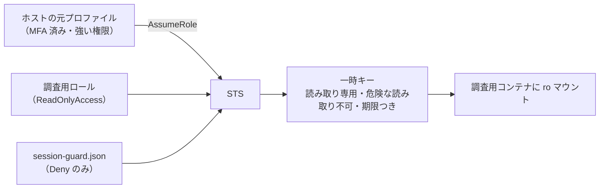
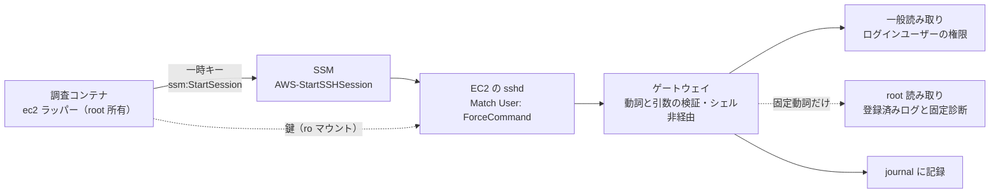

# 安全性の設計について

aws-survey が取っている安全対策について説明します。

## 1. AWS 側の対策

AWS 標準の `ReadOnlyAccess` ポリシーが設定されたロールを利用します。
これによって「リソースを誤って削除してしまう」といった事故は起こりませんが、それだけでは十分ではありません。

例えば `ReadOnlyAccess` ポリシーだけでは、`sqs:ReceiveMessage` のような操作も許されてしまいます。
この操作は読み取りですが、キューの処理に影響を与えてしまい、安全ではありません。

### 対策

エージェントには、`sts:AssumeRole` で新しく発行した一時キーを渡します。
発行時にセッションポリシーを渡すことで、権限を弱めています。



信頼ポリシー（調査用ロールを借りられる相手の名簿）は `environment.json` の `auth.principal_arn` から生成し、`auth.mfa_required` が true なら `aws:MultiFactorAuthPresent` の条件を付けます。
ただし Identity Center でログインしたセッションには、ログインで MFA を通っていてもこの値が付かないため、条件を付けると借りられなくなります。
Identity Center を使うときは `auth.mfa_required` を false にし、MFA は Identity Center のログインで求めます。
`aws-survey init` は Identity Center のログインでは MFA を聞かずに false にし、`aws-survey role --create` は true のままでは条件を書き込まずに止まります。

`aws-survey init` では、借りられる相手を次から選びます。

| 選択肢 | `principal_arn` に入る値 | 借りられる人 |
| --- | --- | --- |
| 自分だけ（既定） | いまのログインの ARN（Identity Center ならセッションの ARN、IAM ユーザーならユーザーの ARN） | あなただけ |
| 同じロールでログインした人なら誰でも | パス付きのロール ARN（Identity Center なら同じ権限セットでログインした人） | そのロールを借りている人全員 |
| 手で入力 | 任意の ARN | その ARN が表す相手 |

既にあるロールの信頼ポリシーと `principal_arn` の書き方が違っても、あなたが借りられるなら `aws-survey role` は不足として扱わず、
範囲の違いを補足に書くだけにします。信頼ポリシーのほうが広い場合（信頼ポリシーがロール ARN で、`principal_arn` がそのロールのセッション ARN）も、
狭い場合（`principal_arn` がロール ARN で、信頼ポリシーがいまのログインのセッション ARN）も同じです。
`aws-survey role --create` を実行すると、信頼ポリシーは `principal_arn` の書き方に書き換わります。

削っている読み取り API は次のとおりです。すべて「読み取り」ですが、機密が出るか、実害があります。

| API | 何が起きるか | `ReadOnlyAccess` | `session-guard.json` |
| --- | --- | --- | --- |
| `sqs:ReceiveMessage` | 本番のキュー処理に影響（読み取りだが副作用がある） | 含まれる | Deny |
| `s3:GetObject` | オブジェクト本文 | 含まれる | Deny |
| `ssm:GetParameter*` | 設定値。接続文字列やパスワードが入りがち | 含まれる | Deny |
| `dynamodb:Query` / `Scan` / `BatchGetItem` / PartiQL | レコード本文 | 含まれる | Deny |
| `logs:GetLogEvents` / `FilterLogEvents` / `StartLiveTail` / `StartQuery` | ログ本文。追尾と課金クエリ | 含まれる | Deny |
| `rds:DownloadDBLogFilePortion` | DB のログファイル | 含まれる | Deny |
| `es:ESHttp*` / `cassandra:*` / `dax:*` / `sdb:Select` | データストアへの直接読み出し | 含まれる | Deny |
| `athena:GetQueryResults` | クエリ結果 | 含まれる | Deny |
| `codecommit:GitPull` | ソースコード全体 | 含まれる | Deny |
| `ecr:GetAuthorizationToken` / `codeartifact:GetAuthorizationToken` | レジストリの認証トークン | 含まれる | Deny |
| `cognito-identity:Get*` | 別の資格情報の取得（権限昇格の経路） | 含まれる | Deny |
| `sts:AssumeRole*` | ロールを借り直して権限を戻す | 含まれない | Deny（二重） |
| `secretsmanager:Get*` | シークレット平文 | 含まれない | Deny（二重） |
| `kms:Decrypt` / `Sign` | 復号・署名の実行 | 含まれない | AND 合成で不可 |

意図的に禁止していないものが 2 つあります。`lambda:GetFunctionConfiguration`（環境変数）と
`ec2:DescribeInstanceAttribute --attribute userData`（起動スクリプト）です。構成把握の価値が高いため通し、
機密が混ざりうる前提でマスクを指示しています。ここだけは権限ではなく指示に頼っています。

## 2. コンテナ側の対策

ユーザーが利用しているホストマシン(macなど)で起動したエージェントは、ユーザーの普段の設定によって強い権限が与えられている可能性があります。  
例えば、非常に強い AWS のクレデンシャルにアクセスできるかもしれません。  
そこで、隔離されたコンテナ環境でエージェントを起動し、弱い権限しか与えられない状態にする必要があります。

### 対策

コンテナには必要最低限の情報しか渡しません。
また、資格情報の再発行機能はホスト側にしかありません。エージェントは、期限が切れたら何もできなくなります。

また、`aws-survey verify` が実際に一時キーを使って、読み取りが通り書き込みが拒否されることを確かめます。

## 3. エージェント側の対策

エージェントの権限設定は、コマンド文字列の先頭一致で判定します。そのため `aws` を禁止しても、次のように書かれると素通りします。

```bash
bash -c "aws ec2 terminate-instances ..."
python3 -c "import boto3; ..."
```

禁止リストは必ず漏れます。また、AWS 側が許す操作の中にも、従量課金が発生する API のように避けたいものがあります。

### 対策

コマンドの実行直前にフックを挟み、許可リスト方式で検査します。実体は `container/hooks/aws-readonly-guard.sh` で、Claude Code と Codex の両方が同じ判定を呼びます。

- `aws` は単独のコマンドのみ。パイプ・連結・`$()`・`bash -c` 経由は拒否します（保存は `> out/…/名前.json` の形だけ許可）
- オペレーションは読み取り動詞のみ（`describe-` / `list-` / `get-` / `lookup-` / `search-` / `search` …）。従量課金の API はここで落ちます
- 機密が出るオペレーション名は、セッションポリシーと二重に拒否します
- 資格情報ファイル・ガード設定・監査ログ・`sudo`・`AWS_*` 環境変数への操作は、常に拒否します

検査したコマンドは、通過・拒否のどちらも `out/_環境/aws-audit.log` に記録します。

## 4. EC2 の中を調べる経路（任意）

`aws-survey ssh setup` で登録したインスタンスに限り、調査コンテナから `ec2 <host> <動詞>` で OS の中
（ログ・サービスの状態・プロセス・ディスク）を調べられます。登録が無い対象では、この経路そのものが存在しません。

**この経路はログ本文を読みます。** 第 1 節で `logs:GetLogEvents` を Deny しているのは、ログ本文に秘密が混ざりうるからです。
EC2 の中を調べる目的はまさにログを読むことなので、ここだけ方針を変えています。秘密らしき値（`password=` `token=`
`Authorization:` アクセスキー・秘密鍵のブロック・URL のユーザー情報）はゲートウェイが `***` に置き換えますが、
**マスクは経験則です。** 第 1 節で意図的に通している `userData` と同じく、機密が混ざりうる前提で扱ってください。

### 経路と、2 つの要素



届くには **IAM と鍵の両方**が要ります。一時キーの `ssm:StartSession` は、`diag:ssh=<name>` タグの付いた
インスタンスと `AWS-StartSSHSession` ドキュメントに限って許され（ロールにアタッチする `diag-ssh-<name>` ポリシー）、
それは 22 番ポートを通すだけで認証は sshd が行います。鍵は調査コンテナに読み取り専用で届き、コンテナの中では作れず、
消せず、書き換えられません。**一時キーだけでは鍵が無いので入れず、鍵だけでは IAM が無いので届きません。**
`ssm:SendCommand`（任意コマンドの実行）は一時キーにありません。導入と撤去はホストの元プロファイルの仕事です。

### 読み取りは 2 段

| 段 | 誰の権限で読むか | 範囲 | 境界 | その内側の事故防止 |
| --- | --- | --- | --- | --- |
| 一般読み取り | ログインユーザー自身 | 任意パスの一覧・閲覧・検索（`ls` `find` `stat` `du` `cat` `head` `tail` `grep`） | **OS の権限。** `/etc/shadow`・`/root`・他人の `~/.ssh` は最初から読めない | 拒否パターン（`.env`・`*.pem`・`*secret*`・`/etc/ssh`・データベース本体 など）、マスク、1 MiB と時間の上限 |
| root 読み取り | `sudo` で呼ばれる専用のヘルパー | 登録済みログと固定の診断（`listeners` `dmesg` `cron` `journal` `log`）だけ | **許可リスト。** 任意パスの読み取りは無く、今後も足さない | 引数をもう一度検証する |

どちらの段でも、シェルは動きません。ゲートウェイは受け取った 1 行を分解し、検証済みの引数を配列のまま実行します。
`;` やパイプや `$()` を解釈する層がありません。書き込み・削除・再起動・プロセスの停止・任意の `sudo` は、動詞として存在しません。
`tail -f`・`top`・`strace`・`tcpdump`・`curl`・プロセスの環境変数（`environ`）も、意図的にありません。

sshd は `ForceCommand` でゲートウェイだけを起動し、端末の割り当て・ポート転送・sftp を拒否します。
調査コンテナで `ssh` を直接打てたとしても、EC2 側ではゲートウェイしか動きません。
`aws-survey ssh verify <host>` が、通るもの・塞がっているもの（`bash`、`'uptime; id'`、`-tt`、`-R`、`-W`、`sftp`、
拒否パターン、`/etc/shadow`）を実際に接続して確かめます。

### EC2 側に残る記録

ゲートウェイは実行の前に、ユーザー・動詞・引数・許可か拒否かを EC2 の journal に書きます。
コンテナの監査ログ（第 3 節）と違い、**この記録は調査エージェントが触れない場所にあります。**
EC2 側で `journalctl -t diag-gateway` を読めば、何が要求され、何が拒否されたかが分かります。

### 感度の高いホスト

`aws-survey ssh setup` の `--strict` で一般読み取り段を無効にし、登録済みログと固定診断だけにできます。
`--deny <glob>` で、そのホスト固有の秘密の置き場を拒否パターンに足せます。
後片付けは `aws-survey ssh remove <host>` です。EC2 に置いたもの（ユーザー `diag`・`/usr/local/lib/diag/`・`/etc/diag/`・
sshd と sudoers の設定・ロック）を撤去し、タグと接続設定を消します。最後のホストを消したときは、接続を許していた
`diag-ssh-<name>` ポリシーも調査用ロールから外して消します（自分で作ったロールのとき。借りたロールでは管理者に打ってもらう
コマンドを表示します）。鍵は `aws-survey ssh rotate` で作り直せます（登録済みホスト全部に再導入し、全部に入ってから差し替えます）。

SSM のセッションは、調査コンテナの `ec2` が接続のたびに、自分の一時キーが同じインスタンスに残した接続中のセッションを探して
終了します（前回の `ssh` が強制終了されて後片付けが動かなかったとき、その次の接続が片付けます）。

## 5. これで保証されないこと

上の 4 つは、事故と行き過ぎを防ぐための多層の対策です。悪意のある相手を想定した境界ではありません。
何が保証され、何が保証されないかを、はっきりさせておきます。

**フックは事故防止策であって、実行経路の境界ではありません。** 検査するのは登録されたツール経由の
コマンドで、すべての経路を網羅しません。隔離を担っているのは Docker と、読み取り専用の一時キーと、
セッションポリシーです。フックはその内側でさらに絞る層です。

**監査ログは改ざん不可能な証跡ではありません。** エージェントとログの書き手は同じ OS ユーザーです。
コンテナの中からの通常の編集とコマンドは拒否しますが、ファイル権限による保護はありません。

**ログに残るのは実行前の判定です。** `ALLOW` は許可したことを意味し、AWS API が成功したことを
意味しません。また共通の Bash ガードが記録対象とするものだけが残ります。

**報告の検証は、独立した監査ではありません。** 統合版は、それを書いた回とは別のセッションが
`raw/` と突き合わせて検証します（`container/method/05_報告の検証.md`）。別のセッションであることが
効くのは、書いたときの記憶が引き継がれないからです。**同じ製品・同じ能力のエージェントを
どう配置しても、独立性は生まれません。** 系統的な誤りは、何度読み直しても同じように見落とされます。
証跡を独立に読めるのは人間だけです。

**EC2 の中で、一般ユーザーが読める場所に置かれた秘密は、読めてしまうことがあります。** 一般読み取り段の
境界は OS の権限で、拒否パターンとマスクはその内側の事故防止です。誰でも読める権限で置かれた `.env` の
写し（別名のファイル）や、ログに平文で出力されたトークンは、パターンに掛からなければそのまま出ます。
機密の置き場が分かっているホストは `--deny` で足し、それでも足りなければ `--strict` にしてください。

**本番機の負荷はゼロではありません。** 上限（優先度の引き下げ・時間・出力サイズ・同時実行 1 本）は掛けていますが、
`grep` や `find` はディスクを読みます。ゲートウェイが動くのは Amazon Linux 2 / 2023、Ubuntu 20.04 以降、
Debian 11 以降で、それ以外の OS では確かめていません。

**検証記録も生データも、エージェントが書いたものです。** `out/` は書き込み可能で、
書き換えを防ぐ仕組みはありません（監査ログを除く）。単体では証拠にならず、それを生成したコマンドが
ログにあることと対で見て初めて意味を持ちます。

重要な判断に使うときは、`out/_環境/aws-audit.log` と `out/<フェーズ>/raw/` を人が直接読んでください。
