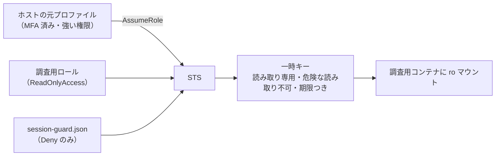

# 安全性の設計について

aws-survey が取っている安全対策について説明します。

## 1. AWS 側の対策

AWS 標準の `ReadOnlyAccess` ポリシーが設定されたロールを利用します。
これによって「リソースを誤って削除してしまう」といった事故は起こりませんが、それだけでは十分ではありません。

例えば `ReadOnlyAccess` ポリシーだけでは、`sqs:ReceiveMessage` のような操作も許されてしまいます。
この操作は読み取りですが、キューの処理に影響を与えてしまい、安全ではありません。

### 対策

エージェントには、`sts:AssumeRole` で新しく発行した一時キーを渡します。
発行時にセッションポリシーを渡すことで、権限を弱めています。



信頼ポリシーは `environment.json` の `auth.principal_arn` から生成し、`auth.mfa_required` が true なら `aws:MultiFactorAuthPresent` の条件を付けます。

削っている読み取り API は次のとおりです。すべて「読み取り」ですが、機密が出るか、実害があります。

| API | 何が起きるか | `ReadOnlyAccess` | `session-guard.json` |
| --- | --- | --- | --- |
| `sqs:ReceiveMessage` | 本番のキュー処理に影響（読み取りだが副作用がある） | 含まれる | Deny |
| `s3:GetObject` | オブジェクト本文 | 含まれる | Deny |
| `ssm:GetParameter*` | 設定値。接続文字列やパスワードが入りがち | 含まれる | Deny |
| `dynamodb:Query` / `Scan` / `BatchGetItem` / PartiQL | レコード本文 | 含まれる | Deny |
| `logs:GetLogEvents` / `FilterLogEvents` / `StartLiveTail` / `StartQuery` | ログ本文。追尾と課金クエリ | 含まれる | Deny |
| `rds:DownloadDBLogFilePortion` | DB のログファイル | 含まれる | Deny |
| `es:ESHttp*` / `cassandra:*` / `dax:*` / `sdb:Select` | データストアへの直接読み出し | 含まれる | Deny |
| `athena:GetQueryResults` | クエリ結果 | 含まれる | Deny |
| `codecommit:GitPull` | ソースコード全体 | 含まれる | Deny |
| `ecr:GetAuthorizationToken` / `codeartifact:GetAuthorizationToken` | レジストリの認証トークン | 含まれる | Deny |
| `cognito-identity:Get*` | 別の資格情報の取得（権限昇格の経路） | 含まれる | Deny |
| `sts:AssumeRole*` | ロールを借り直して権限を戻す | 含まれない | Deny（二重） |
| `secretsmanager:Get*` | シークレット平文 | 含まれない | Deny（二重） |
| `kms:Decrypt` / `Sign` | 復号・署名の実行 | 含まれない | AND 合成で不可 |

意図的に禁止していないものが 2 つあります。`lambda:GetFunctionConfiguration`（環境変数）と
`ec2:DescribeInstanceAttribute --attribute userData`（起動スクリプト）です。構成把握の価値が高いため通し、
機密が混ざりうる前提でマスクを指示しています。ここだけは権限ではなく指示に頼っています。

## 2. コンテナ側の対策

ユーザーが利用しているホストマシン(macなど)で起動したエージェントは、ユーザーの普段の設定によって強い権限が与えられている可能性があります。  
例えば、非常に強い AWS のクレデンシャルにアクセスできるかもしれません。  
そこで、隔離されたコンテナ環境でエージェントを起動し、弱い権限しか与えられない状態にする必要があります。

### 対策

コンテナには必要最低限の情報しか渡しません。
また、資格情報の再発行機能はホスト側にしかありません。エージェントは、期限が切れたら何もできなくなります。

また、`aws-survey verify` が実際に一時キーを使って、読み取りが通り書き込みが拒否されることを確かめます。

## 3. エージェント側の対策

エージェントの権限設定は、コマンド文字列の先頭一致で判定します。そのため `aws` を禁止しても、次のように書かれると素通りします。

```bash
bash -c "aws ec2 terminate-instances ..."
python3 -c "import boto3; ..."
```

禁止リストは必ず漏れます。また、AWS 側が許す操作の中にも、従量課金が発生する API のように避けたいものがあります。

### 対策

コマンドの実行直前にフックを挟み、許可リスト方式で検査します。実体は `container/hooks/aws-readonly-guard.sh` で、Claude Code と Codex の両方が同じ判定を呼びます。

- `aws` は単独のコマンドのみ。パイプ・連結・`$()`・`bash -c` 経由は拒否します（保存は `> out/…/名前.json` の形だけ許可）
- オペレーションは読み取り動詞のみ（`describe-` / `list-` / `get-` / `lookup-` / `search-` …）。従量課金の API はここで落ちます
- 機密が出るオペレーション名は、セッションポリシーと二重に拒否します
- 資格情報ファイル・ガード設定・監査ログ・`sudo`・`AWS_*` 環境変数への操作は、常に拒否します

検査したコマンドは、通過・拒否のどちらも `out/_環境/aws-audit.log` に記録します。

## 4. これで保証されないこと

上の 3 つは、事故と行き過ぎを防ぐための多層の対策です。悪意のある相手を想定した境界ではありません。
何が保証され、何が保証されないかを、はっきりさせておきます。

**フックは事故防止策であって、実行経路の境界ではありません。** 検査するのは登録されたツール経由の
コマンドで、すべての経路を網羅しません。隔離を担っているのは Docker と、読み取り専用の一時キーと、
セッションポリシーです。フックはその内側でさらに絞る層です。

**監査ログは改ざん不可能な証跡ではありません。** エージェントとログの書き手は同じ OS ユーザーです。
コンテナの中からの通常の編集とコマンドは拒否しますが、ファイル権限による保護はありません。

**ログに残るのは実行前の判定です。** `ALLOW` は許可したことを意味し、AWS API が成功したことを
意味しません。また共通の Bash ガードが記録対象とするものだけが残ります。

**報告の検証は、独立した監査ではありません。** 統合版は、それを書いた回とは別のセッションが
`raw/` と突き合わせて検証します（`container/method/05_報告の検証.md`）。別のセッションであることが
効くのは、書いたときの記憶が引き継がれないからです。**同じ製品・同じ能力のエージェントを
どう配置しても、独立性は生まれません。** 系統的な誤りは、何度読み直しても同じように見落とされます。
証跡を独立に読めるのは人間だけです。

**検証記録も生データも、エージェントが書いたものです。** `out/` は書き込み可能で、
書き換えを防ぐ仕組みはありません（監査ログを除く）。単体では証拠にならず、それを生成したコマンドが
ログにあることと対で見て初めて意味を持ちます。

重要な判断に使うときは、`out/_環境/aws-audit.log` と `out/<フェーズ>/raw/` を人が直接読んでください。
